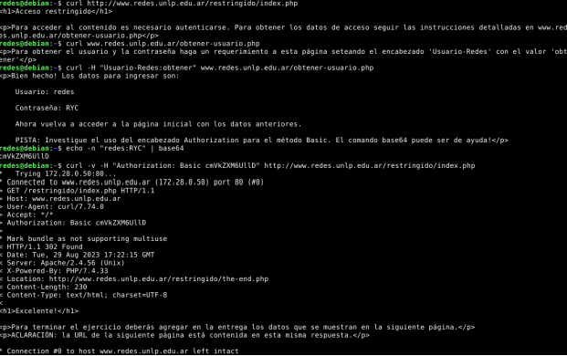
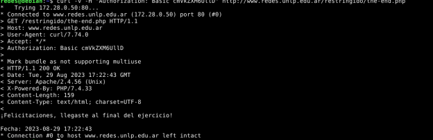
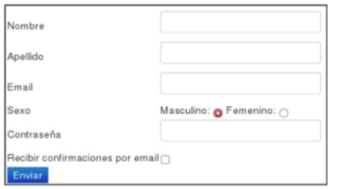

# Practica 2

### 1. ¿Cuál es la función de la capa de aplicación?

    La capa de aplicaicon cumple la funcion de definir el formato de envio de mensajes, definiendo la semantida de cada uno de los mensajes, como debe ser el dialogo(intercambio de mensajes) y con que mensajes deben interactuar. Exiten diferentes protocolos que trabajan de forma binaria usando ASN o otra forma textual ASCII como HTTP.

    - Protocolo HTTP y sus implemntaciones mediante serividores WEB / Navegadores

### 2. Si dos procesos deben comunicarse:

#### a. ¿Cómo podrían hacerlo si están en diferentes máquinas?
    
    Para comunicar dos maquinas diferentes entre si nomralmente se hace mediante el intercambio de mensajes por una red de computadoras. Utilizando un proceso que simula un Emisor/Receptor

    - La PC emisora crea y envia mensajes via red 
    - La PC Receptora recibe el mensaje y responde
    

#### b. Y si están en la misma máquina, ¿qué alternativas existen?

    Se pueden comunicar entre si mediante comunicacion de interprocesos, aplicando reglas impuestas por el sistema operativo del sistema

### 3. Explique brevemente cómo es el modelo Cliente/Servidor. Dé un ejemplo de un sistema Cliente/Servidor en la “vida cotidiana” y un ejemplo de un sistema informático que siga el modelo Cliente/Servidor. ¿Conoce algún otro modelo de comunicación?

    El modelo Cliente/Servidor se basa en comunicar entre sí dos entidades: el cliente, que solicita servicios o recursos, y el servidor, que los proporciona. El cliente inicia la solicitud, y el servidor responde a esas peticiones. Este modelo permite la distribución de tareas, ya que el servidor maneja las operaciones más pesadas, mientras que el cliente se encarga de la interfaz y la presentación de datos.

    Un ejemplo común es un restaurante. El cliente (una persona en una mesa) solicita un plato de comida (servicio), y el servidor (el personal del restaurante) atiende la solicitud y trae el pedido.

    Un ejemplo clásico es un navegador web. El navegador (cliente) solicita una página web al servidor, que almacena la página y se la envía al cliente para que la visualice. El servidor puede ser, por ejemplo, el de Google cuando accedes a su página principal.

    Otro modelo es Peer-to-Peer (P2P), donde no hay una clara distinción entre cliente y servidor. Todos los nodos actúan como iguales, lo que significa que pueden ser tanto proveedores como consumidores de recursos, como sucede en aplicaciones de intercambio de archivos (por ejemplo, BitTorrent).

### 4. Describa la funcionalidad de la entidad genérica “Agente de usuario” o “User agent”. 
    El Agente de Usuario (o User Agent) es un software que actúa como intermediario entre un usuario final y un servicio o sistema. Su principal función es enviar solicitudes en nombre del usuario a un servidor y recibir respuestas. El término se utiliza comúnmente en el contexto de la web, donde un agente de usuario es el software (como un navegador web o una aplicación) que interactúa con el servidor web en nombre del usuario.

    En una solicitud HTTP del navegador, el User Agent es un encabezado que informa sobre el navegador y sistema operativo

### 5. ¿Qué son y en qué se diferencian HTML y HTTP?
    HTTP es el protocolo de transferencia de hipertexto(HTTP,HyperText transfer protocol), que es el protocolo de la capa de aplicancion de la web. HTTP se implementa mediante dos programas un programa cliente y un programa servidor. Ambos programas se ejecutan en sistemas terminales diferentes, se comunican entre si intercambiando mensajes HTTP. HTTP define la estrucutra de estos mensajes y como el cliente y el servidor intercambian los mensajes.

    HTML es un lenguaje de etiquetado que se utiliza para crear estrucutras y contenidos web. Todas las paginas hoy en dia estan construida por un archivo base HTML y varios objetos referenciados.
    este leguaje de etiquetado es interpetado y renderizado por el cliente (navegador).

### 6. HTTP tiene definido un formato de mensaje para los requerimientos y las respuestas. (Ayuda: apartado “Formato de mensaje HTTP”, Kurose).

#### a. ¿Qué información de la capa de aplicación nos indica si un mensaje es de requerimiento o de respuesta para HTTP? ¿Cómo está compuesta dicha información?¿Para qué sirven las cabeceras?

    Identificación del tipo de mensaje:
    La información que nos indica si un mensaje HTTP es de requerimiento o respuesta se encuentra en la línea de inicio de cada mensaje:

    Requerimiento: La línea de inicio de un mensaje de requerimiento comienza con el método HTTP, como GET, POST, PUT, entre otros, seguido de la URL y la versión del protocolo.
    Ejemplo: GET /index.html HTTP/1.1
    Respuesta: La línea de inicio de un mensaje de respuesta comienza con la versión del protocolo, seguida de un código de estado (e.g., 200 para éxito, 404 para no encontrado) y una descripción del estado.
    Ejemplo: HTTP/1.1 200 OK
    Composición de la información:
    Requerimiento:

    Método (e.g., GET, POST)
    URL o ruta del recurso solicitado
    Versión de HTTP (e.g., HTTP/1.1, HTTP/2)
    Respuesta:

    Versión de HTTP
    Código de estado (e.g., 200, 404)
    Descripción del estado
    Función de las cabeceras:
    Las cabeceras HTTP son pares clave-valor que proporcionan información adicional sobre el mensaje, tanto para los requerimientos como para las respuestas. Sirven para:

    Definir las capacidades del cliente o servidor (e.g., tipo de contenido aceptado, compresión soportada).
    Enviar metadatos sobre la solicitud o la respuesta (e.g., longitud del contenido, codificación, autenticación).
    Controlar el comportamiento de la comunicación (e.g., tiempo de caché, políticas de redirección).
    Ejemplo de cabeceras comunes:

    Host: Especifica el servidor de destino.
    User-Agent: Información sobre el cliente (navegador o aplicación).
    Content-Type: Indica el tipo de contenido que se está enviando o recibiendo.
    Accept: Define los tipos de medios que el cliente está dispuesto a recibir

#### b. ¿Cuál es su formato? (Ayuda: https://developer.mozilla.org/es/docs/Web/HTTP/Headers)
    El formato de las cabeceras HTTP sigue una estructura definida de pares clave-valor. Cada línea de cabecera consta de un nombre de cabecera seguido de dos puntos (:) y el valor asociado. A continuación, detallo la estructura y algunos ejemplos clave

    Formato de las cabeceras HTTP

    Cada cabecera sigue este formato: 
    
        Nombre-de-Cabecera: Valor

    Características:

        Nombre de la cabecera:

            Es insensible a mayúsculas y minúsculas. Por ejemplo, Host es equivalente a host.
            Los nombres no deben contener espacios ni caracteres especiales (excepto el guion -).
            Valor:

    Puede ser texto, números, direcciones IP o cualquier información que acompañe a la cabecera. Algunos valores pueden ser listas separadas por comas.
    Ejemplo de valor: text/html o application/json.
    Líneas separadas:

    Cada par nombre-valor de las cabeceras debe estar en una línea separada.

    Línea vacía:

    Entre las cabeceras y el cuerpo (si existe) debe haber una línea vacía para indicar el fin de las cabeceras.
    Ejemplo de cabeceras HTTP
   
        Host: www.example.com
        User-Agent: Mozilla/5.0 (Windows NT 10.0; Win64; x64)
        Accept: text/html,application/xhtml+xml
        Content-Type: application/json
        Content-Length: 348

    Categorías de cabeceras

    Las cabeceras HTTP se pueden clasificar en varias categorías:

    1 - Cabeceras generales: Se aplican tanto a solicitudes como a respuestas.

    Ejemplo: 

        Cache-Control, Connection.
    
    2 - Cabeceras de solicitud: Son específicas para los requerimientos y brindan información sobre el cliente o la solicitud.

    Ejemplo:

        Host: Especifica el dominio del servidor.
        User-Agent: Información sobre el cliente (navegador o aplicación).
    
    
    3 - Cabeceras de respuesta: Se utilizan para proporcionar información adicional en las respuestas del servidor.

    Ejemplo:
    
        Content-Type: Especifica el tipo de contenido (e.g., text/html).
        Content-Length: Longitud del cuerpo de la respuesta.
        
    
    4 - Cabeceras de entidad: Proveen metadatos sobre el cuerpo del mensaje.

    Ejemplo:
        
        Content-Type: Describe el tipo de datos enviados.
        Content-Length: Longitud en bytes del cuerpo del mensaje.

#### c. Suponga que desea enviar un requerimiento con la versión de HTTP 1.1 desde curl/7.74.0 a un sitio de ejemplo como www.misitio.com para obtener el recurso /index.html. En base a lo indicado ¿qué información debería enviarse mediante encabezados? Indique cómo quedaría el requerimiento.
    
    Para enviar un requerimiento HTTP/1.1 usando curl/7.74.0 a www.misitio.com para obtener el recurso /index.html, la solicitud debe incluir la siguiente información en los encabezados:

    Información requerida en el requerimiento:

        1 - Línea de solicitud:

            - Método: GET (se usa para obtener el recurso /index.html).
            - URL: /index.html (el recurso que estamos solicitando).
            - Versión HTTP: HTTP/1.1 (la versión del protocolo HTTP que se está utilizando).
        
        2 - Cabeceras:

            - Host: Especifica el dominio del servidor al que se está realizando la solicitud. En este caso, www.misitio.com.
            - User-Agent: Especifica el software cliente que realiza la solicitud, en este caso, curl/7.74.0.
            - Accept: Indica los tipos de contenido que el cliente está dispuesto a recibir. En este caso, */* indica que acepta cualquier tipo de contenido.
            - Línea vacía: Para indicar el fin de los encabezados (en este caso, no hay cuerpo de mensaje).

        Ejemplo del requerimiento HTTP:
     
            GET /index.html HTTP/1.1
            Host: www.misitio.com
            User-Agent: curl/7.74.0
            Accept: */*

    Explicación:

        GET /index.html: La línea de solicitud especifica que se desea obtener el recurso /index.html desde el servidor www.misitio.com usando el método GET.

        Host: Se requiere en HTTP/1.1 para identificar el servidor al que se está haciendo la solicitud (ya que en algunos casos varios dominios pueden compartir la misma IP).

        User-Agent: Informa al servidor sobre el cliente que está realizando la solicitud. En este caso, curl/7.74.0 indica que la solicitud se hizo con la herramienta curl en su versión 7.74.0.

        Accept: Define qué tipo de respuestas está dispuesto a aceptar el cliente. El valor */* indica que acepta cualquier tipo de contenido, aunque comúnmente los navegadores definen tipos específicos (e.g., text/html).

        Este requerimiento le indicaría al servidor de www.misitio.com que el cliente está solicitando el archivo /index.html y está preparado para recibir cualquier tipo de contenido en la respuesta.

### 7. Utilizando la VM, abra una terminal e investigue sobre el comando curl. Analice para qué sirven los siguientes parámetros (-I, -H, -X, -s).
    Curl es una herramineta para transferir datos desde o hacia un servidor, utilizando uno de los protocolo
    admitidos(DICT,FTP,FTPS,HTTPS,HTTP,IMAP,LDAP,MQTT,POP3,POP3S,RTMP,RTMPS,RTSP,SCP,SFTP,SMB,SMBS,SMTP,SMTPS,TELNET y TFTP). Este comando esta diseñado para trabajar sin interaccion del usuario.

    -I : obtiene solo los encabezados. Los servidores HTTP cuentan con el comando HEAD que utiliza para obtener nada mas el encabezado de un documento

    -H : Sirve para incluir un header adicional en la solicitud HTTP. Se puede especificar cualquier numero de encabezados adicionales. Hay que tener en cuenta que si se agrega un encabezado personalizado que tiene el mismo nombre que uno de los internos que usaria curl se usara el encabezado establecido externamente en lugar del interno

    -X : Especifica un metodo de solicitud personalizado que se utiliza al comunicarse con el servidor HTTP. CURL por defecto utiliza GET.

    -S Modo silencioso de CURL. No mostrara la barra de progreso ni los mensajes de error. Silencia CURL. Es util si deseas que la salida del curl sea mas limpia y solo queres ver la respuesta del servidor

### 8. Ejecute el comando curl sin ningún parámetro adicional y acceda a www.redes.unlp.edu.ar. Luego responda:

#### a. ¿Cuántos requerimientos realizó y qué recibió? Pruebe redirigiendo la salida (>) del comando curl a un archivo con extensión html y abrirlo con un navegador.
    Al ejecutar el comando curl solo con la url por defecto me devolvio un HTML (GET)

#### b. ¿Cómo funcionan los atributos href de los tags link e img en html?
    El atributo href en la etiqueta link se usa para enlzarar recursos externos y el atributo src en la etiqueta img se usa para especificar la ubicaicon de la imagen.
    El navegador realiza solicitudes HTTP/HTTPS para descargar los recursos externos especificados en las urls de los atributos

#### c. Para visualizar la página completa con imágenes como en un navegador,¿alcanza con realizar un único requerimiento?

    No, no alcanza con un unico requerimento. Cada recurso es solicitado al servidor por separado es decir cada imagen,cada archivo html,css,js se solicita por separado

    

#### d. ¿Cuántos requerimientos serían necesarios para obtener una página que tiene dos CSS, dos Javascript y tres imágenes? Diferencie cómo funcionaría un navegador respecto al comando curl ejecutado previamente.

    
    1 requerimientos para el HTML base
    1 requerimientos para el favicon
    2 requerimientos para el CSS
    2 requerimientos para el js
    3 requerimientos para las tres imagenes que aparecen

    Si el HTML tiene algun atributo href tambien se realizaran los requerimientos correspondientes para cada atributo.

    curl solo realiza un solo requerimiento,requiere solicitudes manuales.

### 9. Ejecute a continuación los siguientes comandos:

    curl -v -s www.redes.unlp.edu.ar > /dev/null
    curl -I -v -s www.redes.unlp.edu.ar
    
#### a. ¿Qué diferencias nota entre cada uno?

    -v muestra informacion del intercambio que se esta haciendo entre el cliente y el servidor esta informacio detallada es la que envia el cliente al servidor si se coloca > basicamente mostrara lo que le envio el cliente al servidor y si se coloca < lo que respondio el servidor en cambio -I Indica que solo se soliciten las cabeceras de la respuesta sin descargar el cuerpo del recurso.

    > /dev/null: Redirige la salida estándar del cuerpo de la respuesta a /dev/null, lo que significa que no se muestra el contenido de la página, solo se registra el intercambio de cabeceras y otra información de la conexión

    El primer comando descarga todo el recurso, pero redirige el cuerpo de la respuesta a /dev/null, mientras que el segundo comando únicamente solicita las cabeceras y no descarga el cuerpo del recurso.

    El primer comando usa > /dev/null para evitar mostrar el contenido del cuerpo, mientras que en el segundo comando esto no es necesario porque con -I solo se obtienen las cabeceras

    
#### b. ¿Qué ocurre si en el primer comando se quita la redirección a /dev/null? ¿Por qué no es necesaria en el segundo comando?
    Si se quita la redirección (> /dev/null) en el primer comando, se mostraría todo el contenido de la página (el cuerpo de la respuesta) en la terminal. Sin la redirección, curl descargará la página y la imprimirá junto con las cabeceras y la información del intercambio.

    No es necesaria en el segundo comando porque la opción -I hace que solo se soliciten y muestren las cabeceras de la respuesta, sin descargar el contenido del recurso. Como no hay cuerpo de respuesta, no hay nada que redirigir.

#### c. ¿Cuántas cabeceras viajaron en el requerimiento? ¿Y en la respuesta?
    Cabeceras en el requerimiento (en ambos comandos):

    GET / HTTP/1.1 o HEAD / HTTP/1.1 (según el comando).
    Host: www.redes.unlp.edu.ar
    User-Agent: curl/7.74.0
    Accept: */*
    En total, 4 cabeceras se enviaron en el requerimiento.

    Cabeceras en la respuesta:

    HTTP/1.1 200 OK
    Date: Tue, 10 Sep 2024 16:53:36 GMT.
    Server: Apache/2.4.56 (Unix)
    Last-Modified: Sun, 19 Mar 2023 19:04:46 GMT
    ETag: "1322-5f7457bd64f80"
    Accept-Ranges: bytes
    Content-Length: 4898
    Content-Type: text/html
    En total, 8 cabeceras viajaron en la respuesta.

### 10. ¿Qué indica la cabecera Date?
    La cabecera Date en una respuesta HTTP indica la fecha y hora en que el servidor generó la respuesta. Esta información está expresada en el formato de fecha y hora del estándar HTTP-date, que sigue el formato de fecha GMT (Greenwich Mean Time) o UTC (Tiempo Universal Coordinado).

### 11. En HTTP/1.0, ¿cómo sabe el cliente que ya recibió todo el objeto solicitado de manera completa? ¿Y en HTTP/1.1?
    En HTTP/1.0:
    El cliente se da cuenta de que ha recibido todo el objeto solicitado cuando el servidor cierra la conexión después de enviar la respuesta.
    
    En HTTP/1.1:
    Se introducen mejoras para manejar este problema. El encabezado "ContentLength" indica al cliente la longitud en bytes del objeto en la respuesta, permitiéndole saber cuántos datos esperar. El encabezado "Transfer-Encoding" con valor "chunked" divide la respuesta en trozos, y el cliente detecta el final de
    la respuesta cuando recibe un trozo de tamaño 0.

### 12. Investigue los distintos tipos de códigos de retorno de un servidor web y su significado. Considere que los mismos se clasifican en categorías (2XX, 3XX, 4XX, 5XX).

    1XX (Codigo informativo) : El servidor recibio la peticion y la comienza a procesar

    2XX (Codigo de exito) : El servidor recibio la peticion , la proceso y despues del procesado la solicitud es correcta

    3XX (Codigo de redireccion) : El servidor recibio la solicitud, pero hay una redireccion a alguna otra parte.
    
    4XX (Codigo de error del cliente) : El servidor no puede encontrar la pagina o la web. ERROR DEL LADO WEB

    5XX (Codigo de error del servidor) : El cliente realizo la solicitud valida pero el servidor fallo.

    Ejemplos:
        • 200 OK
        • 301 Moved Permanently
        • 400 Bad Request
        • 403 Access Forbidden
        • 404 Not Found
        • 405 Method Not Allowed
        • 500 Internal Server Error (CGI Error)
        • 501 Method Not Implemented

### 13. Utilizando curl, realice un requerimiento con el método HEAD al sitio www.redes.unlp.edu.ar e indique:
   
#### a. ¿Qué información brinda la primera línea de la respuesta?
    La primera linea me esta brindando como salio la peticion

#### b. ¿Cuántos encabezados muestra la respuesta?
    Muestra
        - Date
        - Server
        - Last-MOdified
        - Etag
        - Accept-Ranges
        - Content-Length
        - Content-Type
    En total 7

#### c. ¿Qué servidor web está sirviendo la página?
    Apache/2.4.56(UNIX)

#### d. ¿El acceso a la página solicitada fue exitoso o no?
    Si fue exitoso ya que la respuesta fue 200 OK

#### e. ¿Cuándo fue la última vez que se modificó la página?
    Se modifico el 19 de marzo de 2023 a las 16:04:46 (19:04:46 GMT)

#### f. Solicite la página nuevamente con curl usando GET, pero esta vez indique que quiere obtenerla sólo si  la misma fue modificada en una fecha posterior a la que efectivamente fue modificada ¿Cómo lo hace? ¿Qué resultado obtuvo? ¿Puede explicar para qué sirve?
    Lo hago haciendo uso del header “If-Modified-Since”:<fecha>
    
    - I : solo me quedo con los encabezados y le digo que si fue modificada despues de esta fecha If-Modified-Since:Sun, 19 Mar 2023 19:04:46 GMT entonces el get lo haga
    - H : envio el encabezado if-modified-since
    curl -I -H "If-Modified-Since:Sun, 19 Mar 2023 19:04:46 GMT" www.redes.unlp.edu.ar

### 14. Utilizando curl, acceda al sitio www.redes.unlp.edu.ar/restringido/index.php y siga las instrucciones y las pistas que vaya recibiendo hasta obtener la respuesta final. Será de utilidad para resolver este ejercicio poder analizar tanto el contenido de cada página como los encabezados.

    El método de autenticación "Basic" en HTTP es una forma simple de autenticar
    a los usuarios utilizando credenciales (nombre de usuario y contraseña). Se
    utiliza en combinación con HTTPS para mayor seguridad.
    El motivo por el cual las credenciales se codifican en base64 es principalmente
    para evitar problemas con caracteres especiales que podrían afectar la
    comunicación HTTP. Base64 es una forma de representar datos binarios en
    una cadena de caracteres ASCII, lo que lo hace seguro para transmitir a través
    de HTTP.

    El encabezado "Location" en HTTP se utiliza para redirigir al cliente a una
    ubicación diferente. Cuando un servidor envía una respuesta con un
    encabezado "Location", está indicando al cliente que realice una nueva
    solicitud a la URL especificada en ese encabezado.

### 15. Utilizando la VM, realice las siguientes pruebas:
    
#### a. Ejecute el comando ’curl www.redes.unlp.edu.ar/extras/prueba-http-1-0.txt’ y copie la salida completa (incluyendo los dos saltos de línea del final).

#### b. Desde la consola ejecute el comando telnet www.redes.unlp.edu.ar 80 y luego pegue el contenido que tiene almacenado en el portapapeles. ¿Qué ocurre luego de hacerlo?

#### c. Repita el proceso anterior, pero copiando la salida del recurso/extras/prueba-http-1-1.txt. Verifique que debería poder pegar varias veces el mismo contenido sin tener que ejecutar el comando telnet nuevamente.

### 16. En base a lo obtenido en el ejercicio anterior, responda:
    
#### a. ¿Qué está haciendo al ejecutar el comando telnet?

#### b. ¿Qué método HTTP utilizó? ¿Qué recurso solicitó?

#### c. ¿Qué diferencias notó entre los dos casos? ¿Puede explicar por qué?

#### d. ¿Cuál de los dos casos le parece más eficiente? Piense en el ejercicio donde analizó la cantidad de requerimientos necesarios para obtener una página con estilos, javascripts e imágenes. El caso elegido, ¿puede traer asociado algún problema?

### 17. En el siguiente ejercicio veremos la diferencia entre los métodos POST y GET. Para ello, erá necesario utilizar la VM y la herramienta Wireshark. 

#### Antes de iniciar considere:
    
    - Capture los paquetes utilizando la interfaz con IP 172.28.0.1. (Menú “Capture -> Options”. Luego seleccione la interfaz correspondiente y presione Start).

    - Para que el analizador de red sólo nos muestre los mensajes del protocolo http introduciremos la cadena ‘http’ (sin las comillas) en la ventana de especificación de filtros de visualización (display-filter). Si no hiciéramos esto veríamos todo el tráfico que es capaz de capturar nuestra placa de red. De los paquetes que son capturados, aquel que esté seleccionado será mostrado en forma detallada en la sección que está justo debajo. Como sólo estamos interesados en http ocultaremos toda la información que no es relevante para esta práctica (Información de trama,
    Ethernet, IP y TCP). Desplegar la información correspondiente al protocolo HTTP
    bajo la leyenda “Hypertext Transfer Protocol”.
    - Para borrar la cache del navegador, deberá ir al menú “Herramientas->Borrar
    historial reciente”. Alternativamente puede utilizar Ctrl+F5 en el navegador para
    forzar la petición HTTP evitando el uso de caché del navegador.
    - En caso de querer ver de forma simplificada el contenido de una comunicación http,
    utilice el botón derecho sobre un paquete HTTP perteneciente al flujo capturado y
    seleccione la opción Follow TCP Stream.

#### a. Abra un navegador e ingrese a la URL: www.redes.unlp.edu.ar e ingrese al link en la sección “Capa de Aplicación” llamado “Métodos HTTP”. En la página mostrada se visualizan dos nuevos links llamados: Método GET y Método POST. Ambos muestran un formulario como el siguiente:
    

#### b. Analice el código HTML

#### c. Utilizando el analizador de paquetes Wireshark capture los paquetes enviados y recibidos al presionar el botón Enviar.

#### d. ¿Qué diferencias detectó en los mensajes enviados por el cliente?

#### e. ¿Observó alguna diferencia en el browser si se utiliza un mensaje u otro?

### 18. Investigue cuál es el principal uso que se le da a las cabeceras Set-Cookie y Cookie en HTTP y qué relación tienen con el funcionamiento del protocolo HTTP.
    
    Las cabeceras Set-Cookie y Cookie en HTTP juegan un papel clave en la gestión de sesiones y estado en aplicaciones web. Dado que el protocolo HTTP es sin estado (stateless), es decir, cada solicitud es independiente y no guarda ninguna relación con las anteriores, las cookies proporcionan un mecanismo para recordar información entre las solicitudes del cliente (normalmente el navegador) y el servidor.

    Set-Cookie
    
    La cabecera Set-Cookie es enviada por el servidor al cliente (navegador) en la respuesta HTTP. Su función principal es almacenar información en el navegador del usuario, que luego será enviada en futuras solicitudes al servidor. Este mecanismo permite al servidor identificar al cliente en las siguientes interacciones.

    Ejemplo de una cabecera Set-Cookie:

        Set-Cookie: session_id=abc123; Path=/; Secure; HttpOnly
    
    
    - session_id=abc123 es la información que se guarda en el cliente.

    - Path=/ indica que la cookie es válida para todas las rutas del sitio.

    - Secure señala que la cookie solo debe enviarse a través de conexiones HTTPS.

    - HttpOnly evita que la cookie sea accesible mediante JavaScript, proporcionando una capa de seguridad contra ataques XSS (Cross-Site Scripting).
    
    La cabecera Cookie es enviada por el cliente (navegador) en las solicitudes HTTP posteriores, transmitiendo las cookies que previamente fueron configuradas por el servidor mediante Set-Cookie. Esta cabecera incluye toda la información relevante almacenada en el navegador y permite al servidor mantener el estado de la sesión.

    Ejemplo de una cabecera Cookie:

        Cookie: session_id=abc123
  
  
    En resumen, Set-Cookie se utiliza para que el servidor almacene una cookie en el navegador del cliente, y la cabecera Cookie es enviada por el cliente en cada solicitud, transmitiendo al servidor los datos almacenados. Este ciclo permite mantener sesiones de usuario y personalizar las interacciones entre el cliente y el servidor, lo cual es fundamental para muchas aplicaciones web interactivas.

### 19. ¿Cuál es la diferencia entre un protocolo binario y uno basado en texto? ¿De qué tipo de protocolo se trata HTTP/1.0, HTTP/1.1 y HTTP/2?

    Un protocolo binario transmite datos en forma de patrones de bits que las máquinas pueden entender directamente. Suele ser más eficiente en términos de velocidad y uso de ancho de banda, ya que no se desperdicia espacio en caracteres de formato o en la interpretación de texto legible por humanos.

    Un protocolo basado en texto envía datos como cadenas legibles utilizando caracteres como letras, números y símbolos. Estos caracteres suelen estar
    codificados en ASCII o UTF-8. Aunque esto hace que la comunicación entre sistemas sea más comprensible para los humanos, puede ser menos eficiente en términos de velocidad y uso de ancho de banda, ya que se requiere más información para representar los mismos datos que en formato binario. HTTP/1.0, HTTP/1.1 son protocolos basados en textos mientras que HTTP/2 es un protocolo binario

### 20. Responder las siguientes preguntas:
#### a. ¿Qué función cumple la cabecera Host en HTTP 1.1? ¿Existía en HTTP 1.0? ¿Qué sucede en HTTP/2? (Ayuda: https://undertow.io/blog/2015/04/27/An-in-depth-overview-of-HTTP2.html para HTTP/2)
    La cabecera “Host” en HTTP 1.1 tiene la función de indicar el nombre de dominio (se puede indicar opcionalmente el puerto) al que se está haciendo
    
    la solicitud dentro del encabezado de la petición. La inclusión de la cabecera "Host" en una solicitud es obligatoria. Esta es sumamente importante en servidores que alojan múltiples sitios web en una misma dirección IP, ya que permite al servidor saber a qué sitio se está dirigiendo la solicitud. También es importante mencionar que las cachés proxy web necesitan la información proporcionada por la línea de cabecera del host.
    
    En HTTP 1.0, la cabecera "Host" no es obligatoria pero puede ser necesaria dependiendo de cómo el servidor web esté configurado. Esto significa que si la cabecera "Host" no estaba presente en una solicitud HTTP 1.0, el servidor asumiría que la solicitud estaba destinada al dominio asociado con la dirección IP del servidor.
    
    En HTTP/2, la cabecera "Host" es reemplazada por “:authority”

#### b. En HTTP/1.1, ¿es correcto el siguiente requerimiento? GET /index.php HTTP/1.1 User-Agent: curl/7.54.0

    No, el requerimiento no es correcto. En HTTP/1.1, la cabecera Host es obligatoria, y no está incluida en este ejemplo. Para que sea correcto, debe añadirse algo como:
        
        GET /index.php HTTP/1.1
        Host: www.ejemplo.com
        User-Agent: curl/7.54.0

#### c. ¿Cómo quedaría en HTTP/2 el siguiente pedido realizado en HTTP/1.1 si se está usando https? GET /index.php HTTP/1.1 Host: www.info.unlp.edu.ar
    
    Quedaría
    
    :method: get
    :path: /index.php
    :scheme: https
    :authority: www.info.unlp.edu.a

    En HTTP/2, el formato de las solicitudes cambia de utilizar cabeceras tradicionales a una serie de "pseudo-cabeceras" que comienzan con :. La cabecera Host se reemplaza por y se agregan otras pseudo-cabeceras como para indicar el protocolo y para el recurso solicitado.

### Ejercicio de Parcial

    curl -X ?? www.redes.unlp.edu.ar/??
    > HEAD /metodos/ HTTP/??
    > Host: www.redes.unlp.edu.ar
    > User-Agent: curl/7.54.0
    < HTTP/?? 200 OK
    < Server: nginx/1.4.6 (Ubuntu)
    < Date: Wed, 31 Jan 2018 22:22:22 GMT
    < Last-Modified: Sat, 20 Jan 2018 13:02:41 GMT
    < Content-Type: text/html; charset=UTF-8
    < Connection: close

#### a. ¿Qué versión de HTTP podría estar utilizando el servidor?

#### b. ¿Qué método está utilizando? Dicho método, ¿retorna el recurso completo solicitado?

#### c. ¿Cuál es el recurso solicitado?

#### d. ¿El método funcionó correctamente?

#### e. Si la solicitud hubiera llevado un encabezado que diga:

#### If-Modified-Since: Sat, 20 Jan 2018 13:02:41 GMT

#### ¿Cuál habría sido la respuesta del servidor web? ¿Qué habría hecho el navegador en este caso?
