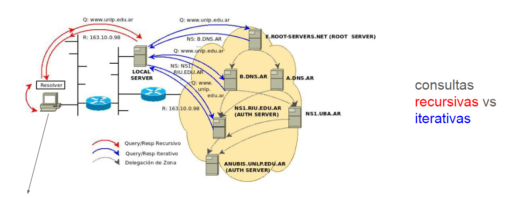
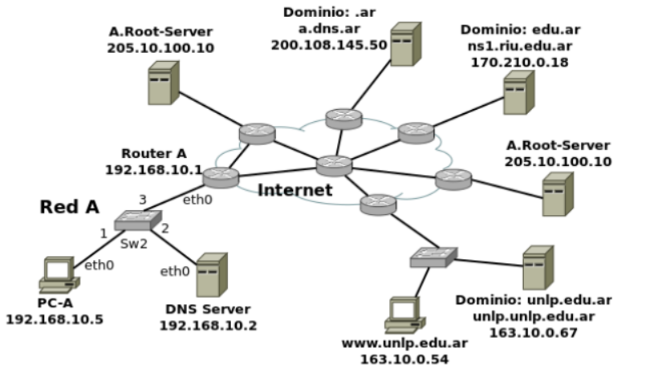

1. Investigue y describa cómo funciona el DNS. ¿Cuál es su objetivo?
---

El DNS (Sistema de Nombres de Dominio, Domain Name System) es un protocolo esencial en internet que actúa como una "agenda telefónica" para traducir nombres de dominio legibles por humanos (como www.ejemplo.com) en direcciones IP numéricas (como 192.0.2.1) que las computadoras utilizan para comunicarse. 
El objetivo prinicpal de un DNS es facilitar el acceso a recursos en internet sin necesidad de recordar direcciones IP complejas.

- Como funciona?
1. Cuando un cliente escribe www.google.com su navegador pregunta a un resolver DNS le podemos llamar como DNS local
2. Si el DNS local o resolver no tiene la respuesta cacheada, inicia una busqueda jeraquica de servidores DNS
3. Comineza la busqueda para por Root Servers, Sv TLD, Autoritativos
4. Luego de encontrar exactamente la respuesta el resolver o DNS local la recibe devuelve la IP al dispositivo y cachea por un tiempo esa busqueda por posible repeticion de busqueda
5. Con la IP obtenida, el navegador se conecta al servidor web asociado al dominio

---
2. ¿Qué es un root server? ¿Qué es un generic top-level domain (gtld)?

Servidor DNS raíz: Es el primer punto de contacto en el sistema DNS, que redirige las consultas 
a los servidores de dominio de nivel superior (TLD). Existen 13 servidores raíz en el mundo.

Generic Top-Level Domain: Los gTLD  son un tipo específico de TLD que no está asociado a un país y brinda las extensiones genéricas más comunes en internet, como .com, .org, .net, .info, y también incluyen nuevas extensiones como .app, .guru, o .tech.

---
3. ¿Qué es una respuesta del tipo autoritativa?

Una respuesta autoritativa es la respuesta definitiva y confiable que proporciona un servidor DNS autoritativo (el dueño oficial de un dominio) cuando se le consulta por un nombre de dominio. A diferencia de las respuestas en caché (que pueden venir de resolvers intermedios), esta proviene directamente de la fuente legítima del dominio.


---

4. ¿Qué diferencia una consulta DNS recursiva de una iterativa?

La diferencia entre una consulta recursiva y iterativa está en quién asume la carga de la búsqueda, en una consulta recursiva el cliente (o resolver DNS/DNS local) delega toda la responsabilidad de la búsqueda al servidor DNS que consulta, en una consulta iterativa el servidor DNS no resuelve el nombre por sí mismo, sino que devuelve referencias a otros servidores para que el cliente continúe la búsqueda.

Comparación:

|   Característica        |     Consulta Recursiva                  | Consulta Iterativa                                 |
|-------------------------|-----------------------------------------|----------------------------------------------------|
|   Quién hace el trabajo |	    El cliente al Resolver/DNS local    |	Resolver/DNS local a los servidores DNS          |
|   Respuesta esperada    |     La IP final (o error)               |   Referencia a otro servidor                       |
|   Uso típico            |     Clientes finales (ej: navegadores)  |   Entre servidores DNS (raíz → TLD → autoritativo) |

- Recursivas: Optimizadas para usuarios finales.
- Iterativas: Mantienen la escalabilidad del DNS, evitando sobrecargar servidores clave.



---

5. ¿Qué es el resolver?

El resolver DNS (también llamado cliente recursivo) es un intermediario que actúa entre tu dispositivo (cliente) y los servidores DNS jerárquicos (raíz, TLD, autoritativos). Su función principal es resolver nombres de dominio en direcciones IP mediante consultas recursivas e iterativas.

---

6. Describa para qué se utilizan los siguientes tipos de registros de DNS:

    1. A : Asocia un nombre de dominio con una dirección IPv4. example.com → 192.0.2.1
    2. MX : Especifica los servidores de correo responsables de recibir los emails dirigidos a un dominio. example.com → mail.example.com (prioridad 10)
    3. PTR : Realiza la resolución inversa, asociando una dirección IP a un nombre de dominio (usado principalmente para troubleshooting y validación de servidores de correo). 192.0.2.1 → example.com
    4. AAAA : Similar al registro A, pero para direcciones IPv6. example.com → 2001:0db8:85a3::8a2e:0370:7334
    5. SRV : Define la ubicación de servicios específicos en un dominio (como VoIP, LDAP, XMPP). Incluye puerto, prioridad, peso y objetivo. _sip._tcp.example.com → servidor SIP en el puerto 5060
    6. NS : Indica los servidores DNS autoritativos para un dominio o subdominio. example.com → ns1.example-dns.com
    7. CNAME : Crea un alias de un nombre de dominio hacia otro (el registro A/AAAA debe estar en el dominio destino). www.example.com → example.com
    8. SOA : Contiene información administrativa sobre la zona DNS (como el servidor DNS primario, correo del administrador, tiempos de refresco y expiración).
    9. TXT : Almacena información textual, como verificaciones de propiedad (Google Search Console), políticas SPF (para email), DKIM (firma de correo), o DMARC
    
---


7. En Internet, un dominio suele tener más de un servidor DNS, ¿por qué cree que esto es
así?

En Internet, es común que un dominio tenga múltiples servidores DNS por varias razones clave, todas relacionadas con la disponibilidad, redundancia, rendimiento y seguridad. A todos nos gusta la rapidez en la busqueda web y los motivos principales son:

tolerancia a fallos:
Si un único servidor DNS falla (por mantenimiento, ataques DDoS o errores técnicos), los demás pueden seguir respondiendo las consultas.
Evita que el dominio quede inaccesible debido a la caída de un solo servidor.

Balanceo de carga:
Distribuir las consultas DNS entre varios servidores reduce la carga en cada uno, mejorando el rendimiento.
Esto es especialmente importante para dominios muy populares (como google.com o facebook.com), que reciben millones de consultas por segundo.

Proximidad geográfica:
Las consultas se dirigen al servidor más cercano, reduciendo la latencia y acelerando la resolución de nombres.

---


8. Cuando un dominio cuenta con más de un servidor, uno de ellos es el primario (o
maestro) y todos los demás son secundarios (o esclavos). ¿Cuál es la razón de que sea
así?
Varios servidores DNS distribuyen la carga y aseguran disponibilidad, pero solo el primario se edita; los secundarios son copias automáticas y de solo lectura,
el servidor primario es la fuente autoritativa de los registros DNS (A, MX, CNAME, etc.). Solo este puede ser modificado directamente, los servidores secundarios sincronizan sus datos desde el primario (mediante transferencias de zona AXFR/IXFR).
Esto evita inconsistencias: si varios servidores pudieran editar registros, habría riesgo de conflictos.
Si el primario cae, los secundarios siguen respondiendo (con los últimos datos sincronizados), pero no se pueden hacer cambios hasta que el primario se recupere o se promueva un secundario a maestro.

---


9. Explique brevemente en qué consiste el mecanismo de transferencia de zona y cuál es
su finalidad.

El mecanismo de transferencia de zona (Zone Transfer) en el sistema de nombres de dominio (DNS) consiste en la replicación de registros DNS desde un servidor primario (maestro) a uno o más servidores secundarios (esclavos). Su finalidad principal es garantizar la consistencia, disponibilidad y redundancia de la información DNS en una red
Finalidad:
Redundancia: Permite que múltiples servidores respondan consultas DNS, evitando puntos únicos de fallo.
Balanceo de carga: Distribuye las solicitudes entre servidores, mejorando el rendimiento.
Resistencia a fallos: Si el servidor primario falla, los secundarios mantienen el servicio activo.
Actualizaciones eficientes: IXFR reduce el ancho de banda al transferir solo cambios.

---

10. Imagine que usted es el administrador del dominio de DNS de la UNLP (unlp.edu.ar). A
su vez, cada facultad de la UNLP cuenta con un administrador que gestiona su propio
dominio (por ejemplo, en el caso de la Facultad de Informática se trata de info.unlp.edu.ar).
Suponga que se crea una nueva facultad, Facultad de Redes, cuyo dominio será
redes.unlp.edu.ar, y el administrador le indica que quiere poder manejar su propio dominio.
¿Qué debe hacer usted para que el administrador de la Facultad de Redes pueda gestionar
el dominio de forma independiente? (Pista: investigue en qué consiste la delegación de
dominios). Indicar qué registros de DNS se deberían agregar.

como administrador del dominio principal unlp.edu.ar, debe realizar una delegación de DNS. Esto implica transferir la autoridad del subdominio a los servidores DNS designados por el administrador de la nueva facultad. 

Pasos a seguir:


El administrador de redes.unlp.edu.ar debe configurar sus propios servidores DNS autoritativos (por ejemplo, ns1.redes.unlp.edu.ar y ns2.redes.unlp.edu.ar).
Debe proporcionar las direcciones IP de dichos servidores.

Configurar la delegación en el dominio principal (unlp.edu.ar):
En la zona DNS de unlp.edu.ar, agregar registros NS que apunten a los servidores DNS de la Facultad de Redes.


Registros DNS a agregar en la zona de unlp.edu.ar:

Registros NS (Name Server):

redes.unlp.edu.ar.    IN    NS    ns1.redes.unlp.edu.ar.
redes.unlp.edu.ar.    IN    NS    ns2.redes.unlp.edu.ar.

Indican qué servidores DNS son responsables del subdominio redes.unlp.edu.ar.

Registros A:

ns1.redes.unlp.edu.ar.    IN    A    192.0.2.1
ns2.redes.unlp.edu.ar.    IN    A    192.0.2.2

Proporcionan las direcciones IP de los servidores DNS del subdominio, permitiendo su resolución desde la zona padre.
---


11. Responda y justifique los siguientes ejercicios.

a. En la VM, utilice el comando dig para obtener la dirección IP del host www.redes.unlp.edu.ar y responda:

i. ¿La solicitud fue recursiva? ¿Y la respuesta? ¿Cómo lo sabe?

Sí, la solicitud fue recursiva.
Indicio: En la sección flags de la respuesta, el flag rd (Recursion Desired) está activo (qr rd ra). Esto indica que el cliente solicitó al servidor DNS (10.255.255.254) que realice una búsqueda recursiva para resolver el nombre www.redes.unlp.edu.ar.
No, la respuesta no fue recursiva.
Indicio:
El servidor DNS (10.255.255.254) respondió directamente con una autoridad final (registro SOA de unlp.edu.ar), lo que sugiere que es autoritativo para el dominio unlp.edu.ar o tiene la información en caché.
Además, el código de estado NXDOMAIN indica que el nombre www.redes.unlp.edu.ar no existe en el DNS.
Si la respuesta fuera recursiva, el servidor habría consultado otros servidores DNS en cascada, pero en este caso, resolvió la consulta directamente.

rd (Recursion Desired): Indica que el cliente solicitó recursividad.
ra (Recursion Available): Indica que el servidor soporta recursividad, pero no necesariamente la usó en esta respuesta.
qr (Query Response): Confirma que es una respuesta, no una consulta.
---

ii. ¿Puede indicar si se trata de una respuesta autoritativa? ¿Qué significa que lo sea?

No, la respuesta no es autoritativa.

Indicios:
En la sección de flags de la respuesta (flags: qr rd ra), no aparece el flag aa (Authoritative Answer). Este flag solo está presente si el servidor que responde es autoritativo para el dominio consultado (www.redes.unlp.edu.ar).

La respuesta incluye un registro SOA del dominio padre unlp.edu.ar, lo que indica que el servidor que respondió (10.255.255.254) no es autoritativo para el subdominio redes.unlp.edu.ar, sino que actúa como un resolver recursivo (por ejemplo, un servidor DNS local o de un ISP).

Una respuesta es autoritativa cuando proviene directamente de un servidor DNS que aloja la zona DNS del dominio consultado (en este caso, redes.unlp.edu.ar). Estos servidores tienen los registros originales del dominio y no dependen de caché o consultas a otros servidores.
---

iii. ¿Cuál es la dirección IP del resolver utilizado? ¿Cómo lo sabe?

La dirección IP del resolver utilizado es 10.255.255.254.

Cómo identificarlo:
En la salida de dig, la línea ;; SERVER: 10.255.255.254#53(10.255.255.254) (UDP) indica el servidor DNS al que se envió la consulta.
10.255.255.254: Dirección IP del resolver.
#53: Puerto utilizado (puerto estándar para DNS).
(UDP): Protocolo usado para la comunicación.
---

b. ¿Cuáles son los servidores de correo del dominio redes.unlp.edu.ar? 

Los servidores de correo del dominio redes.unlp.edu.ar, según la salida del comando dig, son:

mail.redes.unlp.edu.ar con prioridad 5.
mail2.redes.unlp.edu.ar con prioridad 10.

¿Por qué hay más de uno y qué significan los números que aparecen entre MX y
el nombre? 

Múltiples servidores de correo: Tener más de un servidor de correo proporciona redundancia. 
Si un servidor no está disponible (por ejemplo, por mantenimiento o problemas de red), el otro puede encargarse de recibir los correos, asegurando así la continuidad del servicio.

Números entre MX y el nombre (Prioridad): Estos números indican la prioridad de cada servidor de correo. El servidor con el número más bajo tiene mayor prioridad. 
Cuanto más bajo sea el número, mayor será la prioridad, y los correos se intentarán entregar primero al servidor con la prioridad más alta

Si se quiere enviar un correo destinado a redes.unlp.edu.ar, ¿a qué servidor se le entregará?
El correo se entregará primero a mail.redes.unlp.edu.ar (prioridad 5), ya que tiene la prioridad más alta

¿En qué situación se le entregará al otro?

Si mail.redes.unlp.edu.ar (prioridad 5) no está disponible (por problemas técnicos o cualquier otra razón), 
entonces el correo se intentará entregar a mail2.redes.unlp.edu.ar (prioridad 10), que tiene la segunda prioridad.

c. ¿Cuáles son los servidores de DNS del dominio redes.unlp.edu.ar?

```
    franco@DESKTOP-9DOR77R:~$ dig NS redes.unlp.edu.ar

        ; <<>> DiG 9.18.30-0ubuntu0.24.04.2-Ubuntu <<>> NS redes.unlp.edu.ar
        ;; global options: +cmd
        ;; Got answer:
        ;; ->>HEADER<<- opcode: QUERY, status: NXDOMAIN, id: 3117
        ;; flags: qr rd ra; QUERY: 1, ANSWER: 0, AUTHORITY: 1, ADDITIONAL: 1

        ;; OPT PSEUDOSECTION:
        ; EDNS: version: 0, flags:; udp: 4096
        ;; QUESTION SECTION:
        ;redes.unlp.edu.ar.             IN      NS

        ;; AUTHORITY SECTION:
        unlp.edu.ar.            3285    IN      SOA     anubis.unlp.edu.ar. root.anubis.unlp.edu.ar. 2025041104 28800 900 1209600 3600

        ;; Query time: 10 msec
        ;; SERVER: 10.255.255.254#53(10.255.255.254) (UDP)
        ;; WHEN: Sat Apr 12 19:11:39 UTC 2025
        ;; MSG SIZE  rcvd: 94


```
De acuerdo con la salida del comando dig ns redes.unlp.edu.ar no me estan brindando los NS pero investigando otras practicas se pueden obtener estos:
ns-sv-a.redes.unlp.edu.ar
ns-sv-b.redes.unlp.edu.ar

Estos servidores están designados para manejar la resolución de nombres de dominio para `redes.unlp.edu.ar`, es decir, convertir los nombres de dominio en direcciones IP asociadas y viceversa.
Además, en la sección "ADDITIONAL SECTION" del resultado, se proporcionan las direcciones IP correspondientes a estos servidores DNS:
ns-sv-a.redes.unlp.edu.ar tiene la dirección IP 172.28.0.30
ns-sv-b.redes.unlp.edu.ar tiene la dirección IP 172.28.0.29
Estas direcciones IP son cruciales para que los sistemas de otros dominios puedan contactar a estos servidores DNS y obtener información sobre el dominio redes.unlp.edu.ar.

d. Repita la consulta anterior cuatro veces más. ¿Qué observa? ¿Puede
explicar a qué se debe?

cambia la cookie y el when. el when cambia pq es diferente momento q hago la consulta y La cookie cambia en cada consulta porque se genera dinámicamente para cada solicitud de manera que mejora la seguridad de la transacción DNS. Esto previene ataques como la suplantación y asegura que las respuestas que recibes provienen de un servidor DNS legítimo.

e. Observe la información que obtuvo al consultar por los servidores de DNS del
dominio. En base a la salida, ¿es posible indicar cuál de ellos es el primario?

Tienen el mismo nivel de importancia porque el protocolo DNS no define un "primario" o "secundario" en términos de prioridad entre los servidores NS. Ambos sirven como autoridades del dominio, y el resolver DNS puede consultar a cualquiera de ellos.

f. Consulte por el registro SOA del dominio y responda.

    ```
        franco@DESKTOP-9DOR77R:~$ dig soa redes.unlp.edu.ar
            ; <<>> DiG 9.18.30-0ubuntu0.24.04.2-Ubuntu <<>> soa redes.unlp.edu.ar
            ;; global options: +cmd
            ;; Got answer:
            ;; ->>HEADER<<- opcode: QUERY, status: NXDOMAIN, id: 11642
            ;; flags: qr rd ra; QUERY: 1, ANSWER: 0, AUTHORITY: 1, ADDITIONAL: 1

            ;; OPT PSEUDOSECTION:
            ; EDNS: version: 0, flags:; udp: 4096
            ;; QUESTION SECTION:
            ;redes.unlp.edu.ar.             IN      SOA

            ;; AUTHORITY SECTION:
            unlp.edu.ar.            3595    IN      SOA     anubis.unlp.edu.ar. root.anubis.unlp.edu.ar. 2025041104 28800 900 1209600 3600

            ;; Query time: 10 msec
            ;; SERVER: 10.255.255.254#53(10.255.255.254) (UDP)
            ;; WHEN: Sat Apr 12 19:06:29 UTC 2025
            ;; MSG SIZE  rcvd: 94
    ```

    i. ¿Puede ahora determinar cuál es el servidor de DNS primario?
    Si es anubis.unlp.edu.ar.

    ii. ¿Cuál es el número de serie, qué convención sigue y en qué casos es
    importante actualizarlo?

    El numero de serie es '2025041104'
    Hay dos métodos comunes para actualizar el campo SERIAL del
    registro SOA de zona:
    • El primer método es comenzar el número de serie en 1 y
    aumentarlo en cada cambio
    • El segundo es el siguiente utilizando formato
    YYYYMMDDSS que permite saber en qué fecha se creó la
    actualización. Con cada cambio en un mismo día, el número
    de versión (SS) aumenta en una cifra. Al día siguiente
    cambia el número de serie y el número de versión vuelve a
    ponerse a 00.

    iii. ¿Qué valor tiene el segundo campo del registro? Investigue para qué
    se usa y cómo se interpreta el valor.

    El valor es 28800 Se trata del campo “Refresh” que indica cada cuanto tiempo los servidores secundarios deben refrescar desde el primario.

    iv. ¿Qué valor tiene el TTL de caché negativa y qué significa?

    900 Esto quiere decir que si se preguntó por un
    valor en donde el servidor autoritativo respondió que no lo tiene el
    cliente no volverá a preguntar por ese nombre de dominio durante
    900 segundos después de recibir la respuesta negativa
    del servidor autoritativo.


g. Indique qué valor tiene el registro TXT para el nombre
saludo.redes.unlp.edu.ar. Investigue para qué es usado este registro.

```
    franco@DESKTOP-9DOR77R:~$ dig txt saludo.redes.unlp.edu.ar
    ; <<>> DiG 9.18.30-0ubuntu0.24.04.2-Ubuntu <<>> txt saludo.redes.unlp.edu.ar
    ;; global options: +cmd
    ;; Got answer:
    ;; ->>HEADER<<- opcode: QUERY, status: NXDOMAIN, id: 15928
    ;; flags: qr rd ra; QUERY: 1, ANSWER: 0, AUTHORITY: 1, ADDITIONAL: 1

    ;; OPT PSEUDOSECTION:
    ; EDNS: version: 0, flags:; udp: 4096
    ;; QUESTION SECTION:
    ;saludo.redes.unlp.edu.ar.      IN      TXT

    ;; AUTHORITY SECTION:
    unlp.edu.ar.            3580    IN      SOA     anubis.unlp.edu.ar. root.anubis.unlp.edu.ar. 2025041104 28800 900 1209600 3600

    ;; Query time: 10 msec
    ;; SERVER: 10.255.255.254#53(10.255.255.254) (UDP)
    ;; WHEN: Sat Apr 12 19:30:48 UTC 2025
    ;; MSG SIZE  rcvd: 112

```

Cuando un registro TXT existe, se utiliza para almacenar información textual asociada a un nombre de dominio. Algunos de los usos más comunes de los registros TXT incluyen:
 - Verificación de dominio: Para verificar la propiedad de un dominio durante el registro en servicios como Google Workspace, Cloudflare, etc.
 - SPF (Sender Policy Framework): Se utiliza para identificar qué servidores de correo están autorizados a enviar correos electrónicos en nombre de un dominio.
 - DKIM (DomainKeys Identified Mail): Se usa junto con las firmas digitales para verificar la autenticidad de los correos electrónicos.
 - DMARC (Domain-based Message Authentication, Reporting & Conformance): Combina SPF y DKIM para crear una política de correo electrónico más completa.
 - Información general: Puede almacenar cualquier tipo de información textual, como una dirección de correo electrónico de contacto, una política de privacidad, etc.

h. Utilizando dig, solicite la transferencia de zona de redes.unlp.edu.ar, analice la salida y responda.

    ```
        franco@DESKTOP-9DOR77R:~$ dig axfr redes.unlp.edu.ar

    ; <<>> DiG 9.18.30-0ubuntu0.24.04.2-Ubuntu <<>> axfr redes.unlp.edu.ar
    ;; global options: +cmd
    ; Transfer failed.
    ```
    No responde lo esperado

i. ¿Qué significan los números que aparecen antes de la palabra IN?
    ¿Cuál es su finalidad?

### ¿Qué significan esos números?
Esos números representan el **Tiempo de Vida (TTL)**, en inglés *Time To Live*. 
El TTL es un valor numérico que indica durante cuánto tiempo un servidor DNS caché puede almacenar un registro antes de que deba volver a consultarlo al servidor de nombres autorizado. Se expresa en segundos.

### ¿Cuál es su finalidad?
El TTL cumple varias funciones importantes:

- Optimización de consultas: Al almacenar los registros en caché durante un tiempo determinado, se reducen las consultas al servidor de nombres autorizado, mejorando la velocidad de resolución de nombres de dominio.
- Propagación de cambios: El TTL determina la rapidez con la que se propagan los cambios realizados en los registros DNS. Un TTL bajo hace que los cambios se propaguen más rápidamente, mientras que un TTL alto puede retrasar la propagación.
- Control de tráfico: Al ajustar el TTL, se puede controlar el tráfico de consultas DNS hacia los servidores de nombres autorizados.

### ¿Cómo interpretar los valores de TTL?
En el ejemplo que proporcionaste, vemos varios valores de TTL:
- 86400 segundos: Equivale a 24 horas. Es un valor común para registros que no cambian con frecuencia.
- 604800 segundos: Equivale a 7 días. Se utiliza a menudo para registros de servidores de nombres (NS), ya que estos suelen cambiar con menos frecuencia.
- 300 segundos: Equivale a 5 minutos. Se utiliza para registros que necesitan ser actualizados con mayor frecuencia, como los registros A de servidores web.

ii. ¿Cuántos registros NS observa? Compare la respuesta con los
servidores de DNS del dominio redes.unlp.edu.ar que dio
anteriormente. ¿Puede explicar a qué se debe la diferencia y qué
significa?

No observo ningun registro porque la respuesta no entrega infromacion pero en otras practicas de otras personas entrega
4 registros Ns dio ahora contra los 2 anteriormente usando “ns”, 

## Por qué `dig axfr` muestra más registros NS que `dig ns`?

dig NS (Consulta de registros NS)
Qué hace: Consulta los registros NS (Name Server) disponibles públicamente para un dominio, es decir, los servidores de nombres autoritativos delegados por el dominio padre (p. ej., los registros configurados en el TLD .com).
Origen de los datos: Los registros NS obtenidos son los que el dominio padre (p. ej., .com, .net) ha delegado explícitamente para el dominio.

dig axfr (Transferencia de zona completa)
Qué hace: Solicita una transferencia de zona DNS completa, es decir, todos los registros DNS del dominio almacenados en el servidor autoritativo, incluidos los registros NS internos o no delegados.
Origen de los datos: Los registros se obtienen directamente del archivo de zona del servidor DNS autoritativo del dominio.

¿Por qué dig axfr muestra más registros NS?
Registros NS no delegados:
    - El archivo de zona del dominio puede incluir servidores NS internos o secundarios que no están delegados públicamente por el TLD (p. ej., servidores de respaldo o de uso interno).
    - Estos registros NS existen en la zona DNS pero no son visibles públicamente a través de una consulta estándar dig NS.

### Entendiendo la Diferencia

i. Consulte por el registro A de www.redes.unlp.edu.ar y luego por el registro A
de www.practica.redes.unlp.edu.ar. Observe los TTL de ambos. Repita la
operación y compare el valor de los TTL de cada uno respecto de la
respuesta anterior. ¿Puede explicar qué está ocurriendo? (Pista: observar los
flags será de ayuda).

```

franco@DESKTOP-9DOR77R:~$ dig A www.redes.unlp.edu.ar

; <<>> DiG 9.18.30-0ubuntu0.24.04.2-Ubuntu <<>> A www.redes.unlp.edu.ar
;; global options: +cmd
;; Got answer:
;; ->>HEADER<<- opcode: QUERY, status: NXDOMAIN, id: 7912
;; flags: qr rd ra; QUERY: 1, ANSWER: 0, AUTHORITY: 1, ADDITIONAL: 1

;; OPT PSEUDOSECTION:
; EDNS: version: 0, flags:; udp: 4096
;; QUESTION SECTION:
;www.redes.unlp.edu.ar.         IN      A

;; AUTHORITY SECTION:
unlp.edu.ar.            3205    IN      SOA     anubis.unlp.edu.ar. root.anubis.unlp.edu.ar. 2025041104 28800 900 1209600 3600

;; Query time: 9 msec
;; SERVER: 10.255.255.254#53(10.255.255.254) (UDP)
;; WHEN: Sat Apr 12 20:31:39 UTC 2025
;; MSG SIZE  rcvd: 109
```

```
franco@DESKTOP-9DOR77R:~$ dig A www.practica.redes.unlp.edu.ar

; <<>> DiG 9.18.30-0ubuntu0.24.04.2-Ubuntu <<>> A www.practica.redes.unlp.edu.ar
;; global options: +cmd
;; Got answer:
;; ->>HEADER<<- opcode: QUERY, status: NXDOMAIN, id: 50816
;; flags: qr rd ra; QUERY: 1, ANSWER: 0, AUTHORITY: 1, ADDITIONAL: 1

;; OPT PSEUDOSECTION:
; EDNS: version: 0, flags:; udp: 4096
;; QUESTION SECTION:
;www.practica.redes.unlp.edu.ar.        IN      A

;; AUTHORITY SECTION:
unlp.edu.ar.            107     IN      SOA     anubis.unlp.edu.ar. root.anubis.unlp.edu.ar. 2025041104 28800 900 1209600 3600

;; Query time: 10 msec
;; SERVER: 10.255.255.254#53(10.255.255.254) (UDP)
;; WHEN: Sat Apr 12 20:32:28 UTC 2025
;; MSG SIZE  rcvd: 118
```

No se puede resolver porque las flags son iguales

j. Consulte por el registro A de www.practica2.redes.unlp.edu.ar. ¿Obtuvo
alguna respuesta? Investigue sobre los códigos de respuesta de DNS. ¿Para
qué son utilizados los mensajes NXDOMAIN y NOERROR?

Se obtiene una respuesta con el estado “NXDOMAIN”.
El mensaje NXDOMAIN se utiliza para informar que no se pudo encontrar el
nombre de dominio consultado, mientras que el mensaje NOERROR se
utiliza para indicar que la resolución de nombres se realizó con éxito y se
encontró una respuesta válida.

Los códigos de respuesta más comunes:

- 0 (NoError): La consulta se realizó correctamente y se encontró la dirección IP correspondiente.
- 1 (FormErr): La consulta tiene un formato incorrecto.
- 2 (ServFail): El servidor DNS no pudo procesar la consulta debido a un error interno.
- 3 (NXdomain): El dominio solicitado no existe.
- 4 (NotImp): El servidor DNS no soporta la operación solicitada.
- 5 (Refused): El servidor DNS se niega a procesar la consulta.
- 6 (YXdomain): El dominio solicitado no está en la zona de autoridad del servidor.
- 7 (YXRRset): El tipo de registro solicitado no existe en la zona de autoridad.
- 8 (NXRRset): El registro solicitado no existe en la zona de autoridad.
- 9 (NotAuth): El servidor no es autorizado para responder.
- 0 (NotZone): El dominio no está dentro de la zona de este servidor.
- 11 (TAP): Se ha iniciado un proceso de transferencia de zona.
- 12 (Secondary Error): Se produjo un error en un servidor DNS secundario.
- 13 (Non-Existent): El código no existe.
- 16 (NotImplemented): El código no está implementado.
---


12. Investigue los comandos nslookup y host. ¿Para qué sirven? Intente con ambos
comandos obtener:

● Servidores de correo del dominio redes.unlp.edu.ar.
● Servidores de DNS del dominio redes.unlp.edu.ar.

```Nslookup es un programa utilizado para saber si el DNS está resolviendo correctamente los nombres y las IPs. Se utiliza con el comando```

```Host se usa para encontrar la dirección IP del dominio dado y también muestra el nombre de dominio para la IP dada.```

● Dirección IP de www.redes.unlp.edu.ar. 
```
franco@DESKTOP-9DOR77R:~$ nslookup www.redes.unlp.edu.ar
Server:         10.255.255.254
Address:        10.255.255.254#53

** server can't find www.redes.unlp.edu.ar: NXDOMAIN

franco@DESKTOP-9DOR77R:~$ host www.redes.unlp.edu.ar
Host www.redes.unlp.edu.ar not found: 3(NXDOMAIN)
```

● Servidores de correo del dominio redes.unlp.edu.ar.
```
franco@DESKTOP-9DOR77R:~$ nslookup -type=mx redes.unlp.edu.ar
Server:         10.255.255.254
Address:        10.255.255.254#53

** server can't find redes.unlp.edu.ar: NXDOMAIN

franco@DESKTOP-9DOR77R:~$ host -t MX redes.unlp.edu.ar
Host redes.unlp.edu.ar not found: 3(NXDOMAIN)

```

● Servidores de DNS del dominio redes.unlp.edu.ar.
```
franco@DESKTOP-9DOR77R:~$ host -t NS redes.unlp.edu.ar
Host redes.unlp.edu.ar not found: 3(NXDOMAIN)

```
```
franco@DESKTOP-9DOR77R:~$ nslookup -type=ns redes.unlp.edu.ar
Server:         10.255.255.254
Address:        10.255.255.254#53

** server can't find redes.unlp.edu.ar: NXDOMAIN
```


13. ¿Qué función cumple en Linux/Unix el archivo /etc/hosts o en Windows el archivo
\WINDOWS\system32\drivers\etc\hosts?

Es un archivo de texto plano que se encuentra en la mayoría de los sistemas operativos, incluyendo Linux/Unix y Windows. Su función principal es mapear nombres de dominio a direcciones IP de forma local. Esto significa que antes de consultar a los servidores DNS (Sistema de Nombres de Dominio) externos, el sistema busca en este archivo para ver si ya tiene una entrada para el dominio que estás intentando acceder.


14. Abra el programa Wireshark para comenzar a capturar el tráfico de red en la interfaz con
IP 172.28.0.1. Una vez abierto realice una consulta DNS con el comando dig para averiguar
el registro MX de redes.unlp.edu.ar y luego, otra para averiguar los registros NS
correspondientes al dominio redes.unlp.edu.ar. Analice la información proporcionada por dig
y compárelo con la captura.


15. Dada la siguiente situación: “Una PC en una red determinada, con acceso a Internet,
utiliza los servicios de DNS de un servidor de la red”. Analice:

a. ¿Qué tipo de consultas (iterativas o recursivas) realiza la PC a su servidor de
DNS?

En general, una PC en una red local realiza consultas recursivas a su servidor DNS.

En este tipo de consulta, el cliente (la PC) delega completamente la resolución del nombre de dominio al servidor DNS. El servidor DNS se encarga de realizar todas las consultas necesarias hasta encontrar la respuesta final o determinar que no existe. Esto significa que el servidor DNS actúa como un intermediario, resolviendo la consulta en nombre del cliente.

b. ¿Qué tipo de consultas (iterativas o recursivas) realiza el servidor de DNS
para resolver requerimientos de usuario como el anterior? ¿A quién le realiza
estas consultas?

El servidor DNS realiza consultas iterativas a otros servidores DNS.
En este tipo de consulta, el servidor DNS consulta a otro servidor DNS y recibe una respuesta parcial o una referencia a otro servidor. El servidor DNS original debe seguir realizando consultas hasta encontrar la respuesta final o llegar a un servidor que no pueda responder.


16. Relacione DNS con HTTP. ¿Se puede navegar si no hay servicio de DNS?

¿Qué es DNS y HTTP?

- DNS (Domain Name System): Es el sistema de nombres de dominio que traduce nombres de dominio fáciles de recordar (como [se quitó una URL no válida]) a direcciones IP numéricas que las computadoras utilizan para comunicarse.
- HTTP (Hypertext Transfer Protocol): Es el protocolo utilizado para transmitir datos en la World Wide Web. Es el protocolo que permite a los navegadores web solicitar y recibir páginas web desde servidores web.

17. Observar el siguiente gráfico y contestar:




a. Si la PC-A, que usa como servidor de DNS a "DNS Server", desea obtener la
IP de www.unlp.edu.ar, cuáles serían, y en qué orden, los pasos que se
ejecutarán para obtener la respuesta.

El proceso sigue el modelo híbrido recursivo-iterativo típico de DNS.

Paso 1 (Consulta Recursiva - Cliente → DNS Local):
    - PC-A (192.168.10.5) envía una consulta recursiva al DNS local (192.168.10.2):"¿Cuál es la IP de www.unlp.edu.ar?".
    - El DNS Server (resolver) debe responder con la IP o un error (no puede delegar).

Paso 2 (Resolución Iterativa - DNS Local → Jerarquía DNS):

- Si no tiene la respuesta en caché, el DNS local inicia una búsqueda iterativa:

    - Consulta al Root-Server:
        - Pregunta al A.Root-Server (205.10.100.10): "¿Quién maneja .ar?".
        - Respuesta: "Usa a.dns.ar (200.108.145.50)" (referencia a TLD).
    - Consulta al TLD (.ar):
        - Pregunta a a.dns.ar: "¿Quién maneja edu.ar?".
        - Respuesta: "Usa ns1.riu.edu.ar (170.210.0.18)" (referencia a dominio).
    - Consulta al Dominio (edu.ar):
        - Pregunta a ns1.riu.edu.ar: "¿Quién maneja unlp.edu.ar?".
        - Respuesta: "Usa unlp.unlp.edu.ar (163.10.0.67)" (referencia a subdominio).
    - Consulta al Subdominio (unlp.edu.ar):
      - Pregunta a unlp.unlp.edu.ar: "¿Cuál es la IP de www.unlp.edu.ar?".
      - Respuesta Autoritativa: 163.10.0.54 (registro A).

Paso 3 (Respuesta Final - DNS Local → PC-A):
 - El DNS Server (192.168.10.2) guarda la respuesta en caché y envía la IP (163.10.0.54) a PC-A como respuesta recursiva.
--- 

b. ¿Dónde es recursiva la consulta? ¿Y dónde iterativa?

Consulta Recursiva:
Solo ocurre entre el Cliente (PC-A) y el DNS Local (192.168.10.2).
Consultas Iterativas:
Ocurren entre el DNS Local y los servidores de la jerarquía DNS (Root, TLD, Dominio, Subdominio).

18. ¿A quién debería consultar para que la respuesta sobre www.google.com sea
autoritativa?
```m
franco@DESKTOP-9DOR77R:~$ dig www.google.com NS
    ; <<>> DiG 9.18.30-0ubuntu0.24.04.2-Ubuntu <<>> www.google.com NS
    ;; global options: +cmd
    ;; Got answer:
    ;; ->>HEADER<<- opcode: QUERY, status: NOERROR, id: 26366
    ;; flags: qr rd ra; QUERY: 1, ANSWER: 0, AUTHORITY: 1, ADDITIONAL: 1

    ;; OPT PSEUDOSECTION:
    ; EDNS: version: 0, flags:; udp: 4096
    ;; QUESTION SECTION:
    ;www.google.com.                        IN      NS

    ;; AUTHORITY SECTION:
    google.com.             60      IN      SOA     ns1.google.com. dns-admin.google.com. 745681891 900 900 1800 60

    ;; Query time: 39 msec
    ;; SERVER: 10.255.255.254#53(10.255.255.254) (UDP)
    ;; WHEN: Sat Apr 12 22:09:38 UTC 2025
    ;; MSG SIZE  rcvd: 93
```
```m
franco@DESKTOP-9DOR77R:~$ dig @ns1.google.com. www.google.com
    ; <<>> DiG 9.18.30-0ubuntu0.24.04.2-Ubuntu <<>> @ns1.google.com. www.google.com
    ; (2 servers found)
    ;; global options: +cmd
    ;; Got answer:
    ;; ->>HEADER<<- opcode: QUERY, status: NOERROR, id: 9366
    ;; flags: qr aa rd; QUERY: 1, ANSWER: 1, AUTHORITY: 0, ADDITIONAL: 1
    ;; WARNING: recursion requested but not available

    ;; OPT PSEUDOSECTION:
    ; EDNS: version: 0, flags:; udp: 512
    ;; QUESTION SECTION:
    ;www.google.com.                        IN      A

    ;; ANSWER SECTION:
    www.google.com.         300     IN      A       142.251.129.132

    ;; Query time: 29 msec
    ;; SERVER: 216.239.32.10#53(ns1.google.com.) (UDP)
    ;; WHEN: Sat Apr 12 22:10:21 UTC 2025
    ;; MSG SIZE  rcvd: 59

```


19. ¿Qué sucede si al servidor elegido en el paso anterior se lo consulta por
www.info.unlp.edu.ar? ¿Y si la consulta es al servidor 8.8.8.8?

```m
franco@DESKTOP-9DOR77R:~$ dig @ns1.google.com. www.info.unlp.edu.ar

; <<>> DiG 9.18.30-0ubuntu0.24.04.2-Ubuntu <<>> @ns1.google.com. www.info.unlp.edu.ar
; (2 servers found)
;; global options: +cmd
;; Got answer:
;; ->>HEADER<<- opcode: QUERY, status: REFUSED, id: 12860
;; flags: qr rd; QUERY: 1, ANSWER: 0, AUTHORITY: 0, ADDITIONAL: 1
;; WARNING: recursion requested but not available

;; OPT PSEUDOSECTION:
; EDNS: version: 0, flags:; udp: 512
;; QUESTION SECTION:
;www.info.unlp.edu.ar.          IN      A

;; Query time: 29 msec
;; SERVER: 216.239.32.10#53(ns1.google.com.) (UDP)
;; WHEN: Sat Apr 12 22:12:17 UTC 2025
;; MSG SIZE  rcvd: 49


```
Si al servidor le consulto por www.info.unlp.edu.ar no obtengo respuesta ya que dicho servidor no tiene en sus registros el IP de la URL consultada.
El servidor se niega a procesar la consulta

```m
franco@DESKTOP-9DOR77R:~$ dig @8.8.8.8 www.info.unlp.edu.ar

; <<>> DiG 9.18.30-0ubuntu0.24.04.2-Ubuntu <<>> @8.8.8.8 www.info.unlp.edu.ar
; (1 server found)
;; global options: +cmd
;; Got answer:
;; ->>HEADER<<- opcode: QUERY, status: NOERROR, id: 15182
;; flags: qr rd ra; QUERY: 1, ANSWER: 1, AUTHORITY: 0, ADDITIONAL: 1

;; OPT PSEUDOSECTION:
; EDNS: version: 0, flags:; udp: 512
;; QUESTION SECTION:
;www.info.unlp.edu.ar.          IN      A

;; ANSWER SECTION:
www.info.unlp.edu.ar.   213     IN      A       163.10.5.71

;; Query time: 30 msec
;; SERVER: 8.8.8.8#53(8.8.8.8) (UDP)
;; WHEN: Sat Apr 12 22:12:58 UTC 2025
;; MSG SIZE  rcvd: 65

```

Si le consulto al servidor 8.8.8.8 si obtengo respuesta.


Ejercicio de parcial
20. En base a la siguiente salida de dig, conteste las consignas. Justifique en todos los
casos.
;; flags: qr rd ra; QUERY: 1, ANSWER: 2, AUTHORITY: 4, ADDITIONAL: 4
;; QUESTION SECTION:
;ejemplo.com. IN __
;; ANSWER SECTION:
ejemplo.com. 1634 IN __ 10 srv01.ejemplo.com. (1)
ejemplo.com. 1634 IN __ 5 srv00.ejemplo.com. (2)
;; AUTHORITY SECTION:
ejemplo.com. 92354 IN __ ss00.ejemplo.com.
ejemplo.com. 92354 IN __ ss02.ejemplo.com.
ejemplo.com. 92354 IN __ ss01.ejemplo.com.
ejemplo.com. 92354 IN __ ss03.ejemplo.com.
;; ADDITIONAL SECTION:
srv01.ejemplo.com. 272 IN __ 64.233.186.26
srv01.ejemplo.com. 240 IN __ 2800:3f0:4003:c00::1a
srv00.ejemplo.com. 272 IN __ 74.125.133.26
srv00.ejemplo.com. 240 IN __ 2a00:1450:400c:c07::1b
a. Complete las líneas donde aparece __ con el registro correcto.

b. ¿Es una respuesta autoritativa? En caso de no serlo, ¿a qué servidor le preguntaría
para obtener una respuesta autoritativa?
c. ¿La consulta fue recursiva? ¿Y la respuesta?
d. ¿Qué representan los valores 10 y 5 en las líneas (1) y (2).
