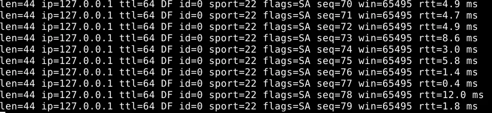

1. ¿Cuál es la función de la capa de transporte?

La capa de transporte es responsable de garantizar la comunicación extremo a extremo entre dispositivos en una red.

Los procesos de aplicación la usan para enviarse mensajes entre ellos sin darle importancia a los detalles de la infraestructura física que se lleva a cabo para realizar los mensajes.

Los protocolos de la capa de transporte se implementan en los sistemas terminales (computadora o dispositivo emisor/receptor) pero no en los routers de la red intermedios. Del lado emisor, la capa de transporte convierte los mensajes recibidos de un procedente en segmentos (paquetes de la capa de transporte), esto se hace dividiendo los mensajes de la app en fragmentos + pequeños y añadiendo una cabecera ((por ejemplo, números de puerto, verificación de errores, etc.). de la capa de transporte a cada fragmento para poder crear el segmento. Luego, la capa de transporte pasa el segmento a la capa de red del sstema terminal emisor, donde el segmento se encapsula dentro de un datagrama (paquete de la capa de red) y se envia al destino. 
Los routers de la red solo actúan sobre los campos correspondientes a la capa de red del datagrama  (como la dirección IP). **No miran el contenido de los segmentos de la capa de transporte**. Para ellos, el segmento es simplemente "carga" o "contenido" del datagrama. En el lado receptor, la capa de red extrae el segmento de la capa de transporte del datagrama y lo sube a la capa de transporte donde **procesa la información**, verifica si hay errores, reordena los segmentos si llegaron desordenados, etc. Finalmente, **reconstruye el mensaje original** y **lo entrega a la aplicación receptora**.
Para las aplicaciones de red puede haber mas de un protocolo de la capa de transporte disponible, por ejemplo Internet tiene TCP y UDP.


[Aplicación emisor]
        ↓
[Capa de transporte] → divide y añade cabecera → Segmentos
        ↓
[Capa de red] → encapsula → Datagramas
        ↓
   [Routers] → solo leen direcciones de red
        ↓
[Capa de red del receptor] → extrae segmento
        ↓
[Capa de transporte] → reordena, verifica, entrega datos
        ↓
[Aplicación receptora]

2. Describa la estructura del segmento TCP y UDP.


### 2. Estructura del segmento TCP y UDP  

#### **Segmento TCP**  
El encabezado TCP tiene **20 bytes** (mínimo) + opciones. Estructura:  

| Campo                  | Tamaño (bytes) | Descripción                                                                 |
|------------------------|----------------|-----------------------------------------------------------------------------|
| **Puerto origen**       | 2              | Puerto de la aplicación emisora.                                           |
| **Puerto destino**      | 2              | Puerto de la aplicación receptora.                                         |
| **Número de secuencia** | 4              | Identifica el orden del segmento.                                           |
| **Número de acuse (ACK)**| 4              | Confirma los datos recibidos (próximo byte esperado).                       |
| **Desplazamiento de datos** | 1          | 4 bits: Longitud del encabezado (en palabras de 32 bits). 6 bits reservados + 6 bits de banderas (SYN, ACK, FIN, etc.).              |
| **Ventana**             | 2              | Espacio disponible en el búfer del receptor (control de flujo).            |
| **Checksum**            | 2              | Verifica la integridad del segmento.                                        |
| **Puntero urgente**     | 2              | Posición de datos urgentes (si la bandera URG está activa).                |
| **Opciones**            | Variable       | Campos adicionales (ej. tamaño máximo de segmento).                        |
| **Datos**               | Variable       | Carga útil transmitida.                                                    |

---

**La cabecera TCP tiene un tamaño mínimo de 20 bytes**, pero puede ser mayor si incluye opciones. Muchos campos tienen 2 o 4 bytes de longitud.

---

### 📌 Campos principales:

- **Número de puerto de origen y número de puerto de destino (2 bytes cada uno):**
    
    Identifican los procesos de aplicación que están comunicándose. El puerto de destino permite al sistema receptor entregar los datos al proceso adecuado, y el puerto de origen permite que el receptor sepa a qué proceso responder.
    

---

- **Número de secuencia (4 bytes):**
    
    Indica el número de secuencia del primer byte de datos del segmento actual. Se utiliza para garantizar que los datos lleguen en el orden correcto y sin duplicados.
    

---

- **Número de acuse de recibo (Acknowledgment Number, 4 bytes):**
    
    Si el bit ACK está activado, este campo indica el número de secuencia que el receptor **espera recibir a continuación**. Es esencial para la confiabilidad del protocolo, ya que confirma qué datos han sido recibidos correctamente.
    

---

- **Longitud de cabecera (4 bits):**
    
    Indica el tamaño de la cabecera TCP en múltiplos de 4 bytes. Esto es necesario porque la cabecera puede tener opciones adicionales.
    

---

- **Bits de control o flags (6 bits más algunos reservados):**
    
    Señales de control utilizadas para gestionar el estado de la conexión. Algunos flags importantes:
    
    - **SYN**: inicia una conexión.
    - **ACK**: confirma recepción.
    - **FIN**: finaliza una conexión.
    - **RST**: reinicia la conexión.
    - **PSH**: entrega inmediata a la aplicación.
    - **URG**: hay datos urgentes.

---

- **Tamaño de la ventana (2 bytes):**
    
    Indica la cantidad máxima de datos que el receptor está dispuesto a aceptar. Es fundamental para el **control de flujo**.
    

---

- **Suma de comprobación (Checksum, 2 bytes):**
    
    Se utiliza para detectar errores en los datos o en la cabecera, similar a UDP, pero más crítica en TCP porque garantiza fiabilidad.
    

---

- **Puntero urgente (Urgent Pointer, 2 bytes):**
    
    Solo se usa si el bit URG está activo. Indica dónde terminan los datos urgentes dentro del segmento.
    

---

- **Opciones (tamaño variable):**
    
    Campo opcional para extender funcionalidades, como el ajuste del tamaño de la ventana o timestamps.
    

---

- **Datos (Payload):**
    
    Es la carga útil del segmento: la información que quiere enviar la aplicación.


#### **Datagrama UDP**  
El encabezado UDP tiene **8 bytes**. Estructura:  

| Campo                  | Tamaño (bytes) | Descripción                                                                 |
|------------------------|----------------|-----------------------------------------------------------------------------|
| **Puerto origen**       | 2              | Puerto de la aplicación emisora (opcional en UDP).                         |
| **Puerto destino**      | 2              | Puerto de la aplicación receptora.                                         |
| **Longitud**            | 2              | Longitud total del datagrama (encabezado + datos, en bytes).               |
| **Checksum**            | 2              | Verifica integridad (obligatorio en IPv6, opcional en IPv4).               |
| **Datos**               | Variable       | Carga útil transmitida.                                                    |

---

#### Diferencias clave:  
- **TCP**: Encabezado complejo con control de flujo, errores y conexiones.  
- **UDP**: Encabezado minimalista, sin garantías de entrega, ideal para aplicaciones en tiempo real.


3. ¿Cuál es el objetivo del uso de puertos en el modelo TCP/IP?

El objetivo de utilizar puertos en el modelo TCP/IP es diferenciar los distintos procesos dentro del mismo nodo terminal para identificar emisores y receptores. Esto resulta fundamental para que se puede establecer la comunicación entre cliente y servidor apartir del uso de puertos en el modelo TCP/IP permitie la identificación y gestión precisa de las comunicaciones entre aplicaciones o servicios en un mismo dispositivo, facilitando la coexistencia de múltiples conexiones de red simultáneas. Esto se logra mediante los siguientes aspectos clave:


1 - Multiplexación y Demultiplexación:
Los puertos permiten que un único dispositivo maneje múltiples aplicaciones o servicios al mismo tiempo. Cuando los datos llegan a una dirección IP, los números de puerto (junto con el protocolo, como TCP o UDP) determinan a qué aplicación específica deben entregarse. Por ejemplo, un servidor web (puerto 80) y un servidor de correo (puerto 25) pueden operar en la misma máquina sin conflicto.

2 - Identificación de Servicios Estándar:
Los puertos bien conocidos (0-1023) están asociados a servicios universales (HTTP: 80, HTTPS: 443, FTP: 21, etc.), lo que simplifica la conexión de clientes sin necesidad de configuraciones adicionales. Esto garantiza que los servicios sean fácilmente localizables en la red.

3 - Gestión de Conexiones Simultáneas:
Los puertos efímeros (generalmente 1024-65535) permiten que un cliente establezca múltiples conexiones simultáneas con servidores. Por ejemplo, un navegador web puede abrir varias pestañas, cada una usando un puerto efímero distinto para comunicarse con el mismo servidor web (puerto 80).

4 - Identificación Única de Sesiones:
La combinación de dirección IP, puerto de origen, dirección IP de destino y puerto de destino crea un identificador único para cada conexión (socket), evitando colisiones y asegurando que los datos se enruten correctamente entre aplicaciones específicas.

5 - Seguridad y Control de Red:
Los puertos son fundamentales para implementar reglas de firewall y políticas de seguridad. Por ejemplo, bloquear el puerto 22 (SSH) restringe el acceso remoto no deseado, mientras que permitir el puerto 443 (HTTPS) habilita tráfico web seguro.

4. Compare TCP y UDP en cuanto a:
a. Confiabilidad
b. Multiplexación.
c. Orientado a la conexión.
d. Controles de congestión.
e. Utilización de puertos.

|  | Confiabilidad | Multiplexación | Orientado a la conexión | Controles de congestión | Utilización de puertos |
| --- | --- | --- | --- | --- | --- |
| TCP | Proporciona una transferencia fiable de datos, asegura la entrega de datos desde el proceso emisor al receptor de manera correcta y ordenada usando control de flujo, numeros de secuencia, temporizadores y reconocimiento.s | Multiplexación y demultiplexación orientada a la conexión.
El socket TCP queda identificado por una 4tupla: dirección IP de origen, nro de puerto de origen, direccionIP de destino, nro puerto de destino. Cuando un segmento TCP llega a un host procedente de la red, el host emplea los 4 valores para dirigir (desmultiplexar) el segmento al socket apropiado | Establece conexión antes de la transmisión de datos y asegura que ambas partes esten sincronizadas en terminos de secuencia de datos y control de flujo | Da mecanismos de control de congestión que evitan que cualquier conexión TCP inunde con una cantidad de tráfico excesiva los enlaces entre hosts que se estan comunicando, esto se consigue regulando la velocidad a  la que los lados emisores de las conexiones tcp pueden enviar tráfico a la red.
Posee un mecanismo que indica al emisor cuánto espacio libre hay en el bufer de almacenamiento del receptor (ventana de recepción)
Ayuda a controlar el flujo de datos para evitar la congestión y garantizar una comunicación eficiente, permitiendo que el emisor ajuste la cantidad de datos enviados en función de la capacidad disponible en el receptor | Como está orientado a la conexión, establece una conexión punto a punto entre dos dispositivos, por lo que cada conexión esta limitada a dos procesos que intercambian datos.
Usa numeros de puerto para identificar aplicaciones específicas |
| UDP | Servicio no fiable, no garantiza que los datos enviados por un proceso lleguen intactos o lleguen al proceso destino | Multiplexación y demultiplexación sin conexión.
El socket UDP queda completamente identificado por una tupla que consta de una dirección IP de destino y un nro de puerto de destino. En consecuencia si dos segmentos UDP tienen diferentes IP y/o nros de puerto origen pero la misma dirección IP de destino y nro de puerto de destino, los dos segmentos se enviarán al mismo proceso de destino a través del mismo socket de destino | No necesita conexión para iniciar y finalizar una transferencia de datos | El tráfico UDP no está regulado, una aplicación que emplee el protocolo de transporte UDP puede enviar los datos a la velocidad que le parezca durante todo el tiempo que quiera | Permite que muchos clientes o procesos envíen datos por el mismo socket. 
Usa nros de puerto para identificar apps específicas |


5. La PDU de la capa de transporte es el segmento. Sin embargo, en algunos contextos
suele utilizarse el término datagrama. Indique cuando.

Porque **UDP** es muy similar a IP en filosofía: es un protocolo **no orientado a conexión**, **simple** y **sin garantías**.

Así que:

- Al **PDU de UDP** se le suele llamar **datagrama UDP**.
- Mientras que al **PDU de TCP** se le llama siempre **segmento TCP**.


6. Describa el saludo de tres vías de TCP. ¿UDP tiene esta característica?

*Paso 1*

- TCP del lado del cliente envía un segmento TCP especial al TCP del lado del servidor
- este segmento especial no contiene datos de la capa de aplicación
- uno de los bits indicadores de la cabecera del segmento → BIT SYN se pone en 1
    - que es el bit syn?  → indica que el segmento está intentando iniciar una conexión
    - por esta razón el segmento especial se referencia como un segmento SYN
- el cliente selecciona de forma aleatoria un número secuencial inicial (cliente_nsi) y lo coloca en el campo número de secuencia del segmento TCP inicial SYN
- este segmento se encapsula dentro de un datagrama IP y se envia al servidor
- importante → la selección aleatoria del valor de cliente_nsi debe hacerse aproximadamente para evitar ciertos ataques de seguridad

*Paso 2*

- una vez que el datagrama IP que contiene el segmento SYN TCP llega al host servidor (suponiendo que lo hace), el servidor lo extrae, asigna buffers y variables TCP a la conexión y envía un segmento de conexión concedida al cliente TCP
- este segmento de conexión concedida tampoco contiene datos de la capa de aplicación
- contiene 3 fragmentos de info importantes de la cabecera del segmento
    - el primero, el bit SYN se pone a 1 para decir que acepta la conexión
    - el segundo, el campo reconocimiento de la cabecera del segmento TCP se hace igual a cliente_nsi+1
    - por último, el servidor elige su propio número de secuencia inicial (servidor_nsi) y almacena este valor en el campo nro de secuencia de la cabecera del segmento TCP
- el segmento de conexión concedida esta diciendo “he recibido tu paquete SYN para iniciar una conexión con tu nro de secuencia inicial, cliente_nsi. Estoy de acuerdo con establecer esta conexión, mi nro de secuencia inicial es servidor_nsi”
- el segmento de conexión concedida se conoce como segmento SYNACK


Paso 3

- Al recibir el segmento SNYACK , el cliente tmb asigna buffers y variables a la conexión
- el host cliente envía al servidor otro segmento, el cual confirma el segmento de conexión concedida al servidor
    - el cliente hace esto almacenando el valor servidor_nsi+1 en el campo de reconocimiento de la cabecera del segmento TCP
- el bit SYN se pone a 0, porque la conexión está establecida
- en esta etapa se puede transportar datos del cliente al servidor dentro de la carga útil del segmento

UDP no tiene esto porque →

Porque **UDP es un protocolo sin conexión (connectionless)**. Eso significa que **no necesita establecer una conexión antes de enviar datos**.

- No hay SYN, ni ACK, ni números de secuencia.
- Simplemente: si una app quiere mandar algo, arma el datagrama UDP y lo manda directo

7. Investigue qué es el ISN (Initial Sequence Number). Relaciónelo con el saludo de tres vías.

ISN = primer número de secuencia TCP para identificar los datos en cada extremo.

El **ISN** es el **Número de Secuencia Inicial** que **TCP** asigna al comienzo de una conexión.

- Cada lado (cliente y servidor) elige un **ISN aleatorio**.
- Sirve para identificar de forma única los bytes de datos que se van a transmitir.
- Es importante para:
    - Controlar el orden de los datos.
    - Detectar duplicados.
    - Aumentar la **seguridad** (evitar ciertos ataques, como suplantación de conexión).

**Dato:**

El ISN no suele empezar en 0, sino que se elige de manera **pseudorrandom** (aleatoria) para mayor seguridad.

El **saludo de tres vías** es el proceso de TCP para **establecer una conexión** segura y confiable.

Ocurre en tres pasos:

1. **SYN:**
    - El **cliente** envía un segmento con la bandera **SYN** activa.
    - Dentro de este SYN incluye **su propio ISN**.
2. **SYN-ACK:**
    - El **servidor** responde con un segmento que tiene las banderas **SYN** y **ACK** activas.
    - El servidor incluye:
        - Su **propio ISN**.
        - Un **ACK** que confirma el ISN del cliente (+1).
3. **ACK:**
    - El **cliente** envía un último segmento con la bandera **ACK** activada.
    - Este ACK confirma el ISN del servidor (+1).
    - **Después de esto**, la conexión TCP queda establecida y ambos lados pueden empezar a enviar datos.


### Gráficamente:

```
Cliente                                Servidor
   | --------- SYN(ISN_C) -----------> |
   | <------ SYN(ISN_S) + ACK(ISN_C+1) |
   | --------- ACK(ISN_S+1) ----------> |

```

- **ISN_C** = ISN del Cliente
- **ISN_S** = ISN del Servidor

8. Investigue qué es el MSS. ¿Cuándo y cómo se negocia?

### ¿Cuándo y cómo se **negocia** el MSS?

- El **MSS se negocia durante el saludo de tres vías (three-way handshake)** de TCP.
- Cada lado (cliente y servidor) puede anunciar su MSS en el primer segmento **SYN**.
- **Importante:**
    - El MSS que se usa en la conexión es típicamente el más pequeño de los anunciados por ambos lados.
    - Esto evita que un extremo envíe segmentos demasiado grandes para el otro.

### Paso a paso:

1. El **cliente** envía un SYN y dentro incluye una **opción TCP** que indica su MSS.
2. El **servidor** responde con su SYN-ACK, también indicando su propio MSS.
3. Cada parte ajusta su comportamiento usando el valor más pequeño recibido.

### ¿Por qué es importante?

- Evita la fragmentación de paquetes IP (que sería costosa).
- Optimiza el rendimiento.
- Reduce la probabilidad de pérdidas en la red.

Ejemplo gráfico:

```
Cliente                                     Servidor
   | ---- SYN (MSS = 1460) ---------------> |
   | <--- SYN-ACK (MSS = 1400) ------------- |
   | ---- ACK -----------------------------> |
```
Resultado: Se usará MSS = 1400


9. Utilice el comando ss (reemplazo de netstat) para obtener la siguiente información de su
PC:


a. Listar comunicaciones TCP establecidas

ss -t -a | grep ESTAB
-t: Muestra solo conexiones TCP.

-a: Incluye todos los sockets (activos y en escucha).

grep ESTAB: Filtra solo conexiones establecidas.

b. Listar comunicaciones UDP establecidas

ss -u -a
-u: Muestra solo conexiones UDP.

Nota: UDP no tiene estado "ESTABLECIDO" (es un protocolo sin conexión).

c. Servicios TCP en espera (listening)

ss -t -l
-l: Muestra solo sockets en modo escucha (listening).

d. Servicios UDP en espera (listening)

ss -u -l
e. Mostrar procesos asociados a las conexiones
Agregamos -p para ver el proceso relacionado:


ss -t -a -p | grep ESTAB  # TCP establecidas con proceso
ss -u -a -p               # UDP con proceso
ss -t -l -p               # TCP en escucha con proceso
ss -u -l -p               # UDP en escucha con proceso
Usando el comando netstat (alternativa antigua)

a. TCP establecidas


netstat -t -a | grep ESTABLISHED
-t: TCP.

-a: Todas las conexiones.


b. UDP establecidas

netstat -u -a
UDP no tiene estado "ESTABLISHED".

c. Servicios TCP en espera

netstat -t -l

d. Servicios UDP en espera

netstat -u -l


e. Mostrar procesos asociados
Agregamos -p (requiere sudo para ver todos):

sudo netstat -t -a -p | grep ESTABLISHED  # TCP con proceso
sudo netstat -u -a -p                     # UDP con proceso
sudo netstat -t -l -p                     # TCP en escucha con proceso
sudo netstat -u -l -p                     # UDP en escucha con proceso


10. ¿Qué sucede si llega un segmento TCP con el flag SYN activo a un host que no tiene
ningún proceso esperando en el puerto destino de dicho segmento (es decir, el puerto
destino no está en estado LISTEN)?

El host responde automáticamente con un segmento TCP con el flag RST (Reset) activo.

### Explicación más detallada:

- El segmento que llegó tenía el flag **SYN** activado: es decir, alguien quiere **iniciar una conexión TCP** a un puerto específico.
- Pero en el host **no hay ningún proceso escuchando** en ese puerto (ningún `socket` en estado `LISTEN`).
- Entonces, según el estándar de TCP, **el host rechaza la solicitud** enviando un paquete **TCP con el flag RST**.
- El paquete RST **corta la conexión abruptamente**: le dice al cliente "No existe ningún servicio aquí".

### ¿Por qué el flag **RST**?

- Porque **RST** en TCP significa "algo anda mal o no autorizado, cerrá esta conexión de inmediato".
- Esto evita que el cliente quede esperando sin saber qué pasó.

a. Utilice hping3 para enviar paquetes TCP al puerto destino 22 de la máquina virtual
con el flag SYN activado.



b. Utilice hping3 para enviar paquetes TCP al puerto destino 40 de la máquina virtual
con el flag SYN activado.

.webp)

c. ¿Qué diferencias nota en las respuestas obtenidas en los dos casos anteriores?
¿Puede explicar a qué se debe? (Ayuda: utilice el comando ss visto anteriormente).

### 📊 **Comparación de resultados:**

### a. Envío de paquetes TCP SYN al **puerto 22**:

- Respuesta: `flags=SA` → **SYN + ACK**
- Esto indica que el puerto **está abierto** y **hay un proceso escuchando** (por ejemplo, `sshd` para conexiones SSH).

### b. Envío de paquetes TCP SYN al **puerto 40**:

- Respuesta: `flags=RA` → **RST + ACK**
- Esto significa que el puerto **está cerrado**, **no hay ningún proceso escuchando** en ese puerto.

---

### 🧠 ¿A qué se debe esta diferencia?

Cuando enviás un segmento TCP con el flag **SYN**:

### 🔓 **Caso puerto abierto (22):**

- Hay un proceso escuchando (estado `LISTEN`).
- El sistema responde con un **SYN+ACK**, lo que forma parte del saludo de tres vías (3-way handshake) de TCP.

### 🔒 **Caso puerto cerrado (40):**

- No hay ningún proceso escuchando en ese puerto.
- El sistema responde con un **RST+ACK**, lo que es una forma de **rechazar** la conexión, diciendo "no hay nadie acá".


### 🔧 ¿Cómo podés verificarlo con `ss`?

Usá el siguiente comando:

```bash
sudo ss -tln

```

- `t` → conexiones TCP
- `l` → solo sockets en estado `LISTEN`
- `n` → no resuelve nombres (más rápido y claro)

### 🔍 Resultado esperado:

- Verás una línea como esta para el puerto 22:

```
LISTEN  0  128  0.0.0.0:22  0.0.0.0:*

```

- Pero **no** deberías ver nada con `:40`, lo que confirma que el puerto 40 **no está en escucha**.

11. ¿Qué sucede si llega un datagrama UDP a un host que no tiene ningún proceso
esperando en el puerto destino de dicho datagrama (es decir, que dicho puerto no está en
estado LISTEN)?


El host responde con un mensaje ICMP de tipo “Destino inalcanzable: puerto inalcanzable”.

### Por qué ocurre esto?

- A diferencia de TCP, **UDP no tiene un mecanismo interno de conexión o verificación**.
- Si un **datagrama UDP** llega a un puerto en el que **no hay ningún proceso escuchando**, el sistema operativo **no sabe qué hacer con ese datagrama**.
- Entonces, **descarta** el datagrama y responde (si no hay un firewall que lo bloquee) con un **paquete ICMP** que indica:
    
    > 🚫 "Puerto inalcanzable"

### 🔎 ¿Qué tipo de ICMP es?

- **Tipo 3, Código 3** → ICMP Destination Unreachable - Port Unreachable

| Protocolo | Puerto cerrado | Respuesta |
| --- | --- | --- |
| **TCP** | No hay `LISTEN` | Envía **TCP RST** |
| **UDP** | No hay proceso escuchando | Envía **ICMP Port Unreachable** |

a. Utilice hping3 para enviar datagramas UDP al puerto destino 5353 de la máquina
virtual.

.webp)


b. Utilice hping3 para enviar datagramas UDP al puerto destino 40 de la máquina
virtual.

.webp)

c. ¿Qué diferencias nota en las respuestas obtenidas en los dos casos anteriores?
¿Puede explicar a qué se debe? (Ayuda: utilice el comando ss visto anteriormente).


### **Caso a: UDP al puerto 5353**

```bash
sudo hping3 --udp -p 5353 localhost

```

- No hubo respuestas ICMP del sistema.
- El puerto 5353 **está abierto** y **hay un proceso escuchando** (probablemente `avahi-daemon`, que usa mDNS en ese puerto).
- Al estar en uso, **el datagrama UDP es recibido normalmente** por ese proceso.
- **UDP no genera respuesta por defecto**, así que **no se ve ninguna salida adicional**.

---

### 🔍 **Caso b: UDP al puerto 40**

```bash
sudo hping3 --udp -p 40 localhost

```

- El sistema responde con múltiples mensajes:
    
    ```
    ICMP Port Unreachable from 127.0.0.1
    
    ```
    
- Eso indica que **no hay ningún proceso escuchando en el puerto 40**.
- El sistema operativo **descarta el datagrama** y **envía una respuesta ICMP tipo 3 código 3** (Puerto inalcanzable).
- Esto es el comportamiento estándar cuando **no hay una aplicación asociada a ese puerto UDP**.


- **UDP es un protocolo sin conexión** y **no asegura entrega**, pero el sistema operativo **informa errores graves** como cuando **no hay nadie escuchando en el puerto destino**.
- Cuando **sí hay alguien escuchando**, el datagrama es entregado silenciosamente, y no se genera ninguna respuesta visible (a menos que la aplicación lo haga).

12. Investigue los distintos tipos de estado que puede tener una conexión TCP.
Ver
https://users.cs.northwestern.edu/~agupta/cs340/project2/TCPIP_State_Transition_Diagram
.pdf

TCP es un protocolo orientado a la conexión y su funcionamiento se basa en una **máquina de estados finita**. Cada conexión TCP puede estar en uno de varios estados a lo largo de su ciclo de vida, desde el establecimiento hasta la finalización de la conexión.

Basándonos en el diagrama de transición de estados TCP del link proporcionado, los principales **estados TCP** son los siguientes:

| Estado | Descripción |
| --- | --- |
| **CLOSED** | No hay conexión. Estado inicial o final. |
| **LISTEN** | El servidor está esperando una conexión entrante (pasivo). |
| **SYN_SENT** | Cliente envió un SYN y espera un SYN+ACK (activo). |
| **SYN_RECEIVED** | El host recibió un SYN y respondió con SYN+ACK, espera ACK. |
| **ESTABLISHED** | Conexión abierta y datos pueden transferirse. |
| **FIN_WAIT_1** | Una de las partes cerró su lado (envió FIN). Espera ACK. |
| **FIN_WAIT_2** | Recibió ACK del FIN, espera FIN del otro lado. |
| **CLOSE_WAIT** | Recibió FIN del otro lado, pero aún no cerró su lado. |
| **CLOSING** | Ambos lados enviaron FIN simultáneamente. Espera ACK. |
| **LAST_ACK** | Envió FIN luego de recibir uno. Espera ACK final. |
| **TIME_WAIT** | Espera para asegurarse de que el otro lado recibió el último ACK. |
| **(re)CLOSED** | Luego de TIME_WAIT, vuelve al estado CLOSED. |

### Establecimiento (cliente-activo, servidor-pasivo):

1. Cliente: `CLOSED → SYN_SENT` (envía SYN)
2. Servidor: `LISTEN → SYN_RECEIVED` (recibe SYN, envía SYN+ACK)
3. Cliente: `SYN_SENT → ESTABLISHED` (recibe SYN+ACK, envía ACK)
4. Servidor: `SYN_RECEIVED → ESTABLISHED` (recibe ACK)

### Cierre de la conexión:

1. Cliente: `ESTABLISHED → FIN_WAIT_1` (envía FIN)
2. Servidor: `ESTABLISHED → CLOSE_WAIT` (recibe FIN, envía ACK)
3. Cliente: `FIN_WAIT_1 → FIN_WAIT_2` (recibe ACK)
4. Servidor: `CLOSE_WAIT → LAST_ACK` (envía FIN)
5. Cliente: `FIN_WAIT_2 → TIME_WAIT` (recibe FIN, envía ACK)
6. Cliente: `TIME_WAIT → CLOSED` (tras un tiempo)
7. Servidor: `LAST_ACK → CLOSED` (recibe ACK final)


13. Dada la siguiente salida del comando ss, responda:

```py
    Netid State Recv-Q Send-Q Local Address:Port Peer Address:Port Process
    tcp LISTEN 0 128 *:22 *:* users:(("sshd",pid=468,fd=29))
    tcp LISTEN 0 128 *:80 *:* users:(("apache2",pid=991,fd=95))
    udp LISTEN 0 128 163.10.5.222:53 *:* users:(("named",pid=452,fd=10))
    tcp ESTAB 0 0 163.10.5.222:59736 64.233.163.120:443 users:(("x-www-browser",pid=1079,fd=51))
    tcp CLOSE-WAI T 0 0 163.10.5.222:41654 200.115.89.30:443
    users:(("x-www-browser",pid=1079,fd=50))
    tcp ESTAB 0 0 163.10.5.222:59737 64.233.163.120:443 users:(("x-www-browser",pid=1079,fd=55))
    tcp ESTAB 0 0 163.10.5.222:33583 200.115.89.15:443 users:(("x-www-browser",pid=1079,fd=53))
    tcp ESTAB 0 0 163.10.5.222:45293 64.233.190.99:443 users:(("x-www-browser",pid=1079,fd=59))
    tcp LISTEN 0 128 *:25 *:* users:(("postfix",pid=627,fd=3))
    tcp ESTAB 0 0 127.0.0.1:22 127.0.0.1:41220 users:(("sshd",pid=1418,fd=3),
    ("sshd",pid=1416,fd=3))
    tcp ESTAB 0 0 163.10.5.222:52952 64.233.190.94:443 users:(("x-www-browser",pid=1079,fd=29))
    tcp TIME-WAIT 0 0 163.10.5.222:36676 54.149.207.17:443 users:(("x-www-browser",pid=1079,fd=3))
    tcp ESTAB 0 0 163.10.5.222:52960 64.233.190.94:443 users:(("x-www-browser",pid=1079,fd=67))
    tcp ESTAB 0 0 163.10.5.222:50521 200.115.89.57:443 users:(("x-www-browser",pid=1079,fd=69))
    tcp SYN-SENT 0 0 163.10.5.222:52132 43.232.2.2:9500 users:(("x-www-browser",pid=1079,fd=70))
    tcp ESTAB 0 0 127.0.0.1:41220 127.0.0.1:22 users:(("ssh",pid=1415,fd=3))
    udp LISTEN 0 128 127.0.0.1:53 *:* users:(("named",pid=452,fd=9))
```

a. ¿Cuántas conexiones hay establecidas?

9
b. ¿Cuántos puertos hay abiertos a la espera de posibles nuevas conexiones?

5
c. El cliente y el servidor de las comunicaciones HTTPS (puerto 443), ¿residen en la
misma máquina?

No, el cliente y el servidor
**no residen en la misma máquina**

IP del cliente (origen): 163.10.5.222 (tu máquina local, ejecutando x-www-browser).
IP del servidor (destino): 64.233.163.120
La IP local (```163.10.5.222```) se conecta a **servidores remotos** a través del puerto 443, típico de HTTPS.

d. El cliente y el servidor de la comunicación SSH (puerto 22), ¿residen en la misma
máquina?
Si las IP del cliente y la IP del servidor son la misma

e. Liste los nombres de todos los procesos asociados con cada comunicación. Indique
para cada uno si se trata de un proceso cliente o uno servidor.

###  Conexiones `LISTEN` → **Procesos Servidor**

Estos están **esperando conexiones**:

| Puerto | Proceso | Tipo |
| --- | --- | --- |
| 22/tcp | `sshd` | Servidor |
| 80/tcp | `apache2` | Servidor |
| 25/tcp | `postfix` | Servidor |
| 53/udp (local y externo) | `named` | Servidor |

---

###  Conexiones `ESTAB` (establecidas) → **Procesos Cliente o ambos**

Estas son conexiones ya activas. Vamos una por una:

### HTTPS (puerto 443)
| Local Port | Remoto IP | Proceso | Tipo |
| --- | --- | --- | --- |
| 59736 | 64.233.163.120:443 | `x-www-browser` | Cliente |
| 59737 | 64.233.163.120:443 | `x-www-browser` | Cliente |
| 33583 | 200.115.89.15:443 | `x-www-browser` | Cliente |
| 45293 | 64.233.190.99:443 | `x-www-browser` | Cliente |
| 52952 | 64.233.190.94:443 | `x-www-browser` | Cliente |
| 52960 | 64.233.190.94:443 | `x-www-browser` | Cliente |
| 50521 | 200.115.89.57:443 | `x-www-browser` | Cliente |

Conexión SSH (puerto 22)
Hay dos conexiones SSH establecidas y ambas son locales (127.0.0.1):

| Puerto Local | IP Remota     | Proceso         | Rol       | Observación                          |
|--------------|---------------|-----------------|-----------|--------------------------------------|
| 41220       | 127.0.0.1:22  | `ssh`           | **Cliente** | Conexión SSH **desde** la máquina local. |
| 22          | 127.0.0.1:41220 | `sshd`         | **Servidor** | Servidor SSH **aceptando** la conexión. |

f. ¿Cuáles conexiones tuvieron el cierre iniciado por el host local y cuáles por el
remoto?

Para determinar quién inició el cierre de una conexión TCP (host local o remoto), podemos mirar el estado de la conexión y el proceso asociado en la salida del comando ss.
- **`TIME-WAIT`**: el **host local inició el cierre**.
- **`CLOSE-WAIT`**: el **host remoto inició el cierre**.

### `tcp TIME-WAIT`

```
163.10.5.222:36676 54.149.207.17:443 users:(("x-www-browser",pid=1079,fd=3))

```

El **host local (163.10.5.222)** cerró primero.

**Cierre iniciado por el local.**

---

### `tcp CLOSE-WAIT`

```
163.10.5.222:41654 200.115.89.30:443 users:(("x-www-browser",pid=1079,fd=50))

```

El **host remoto (200.115.89.30)** cerró primero.

🔴 **Cierre iniciado por el remoto.**

g. ¿Cuántas conexiones están aún pendientes por establecerse?

1


14. Dadas las salidas de los siguientes comandos ejecutados en el cliente y el servidor,
responder:

```py
servidor# ss -natu | grep 110
tcp LISTEN 0 0 *:110 *:*
tcp SYN-RECV 0 0 157.0.0.1:110 157.0.11.1:52843
cliente# ss -natu | grep 110
tcp SYN-SENT 0 1 157.0.11.1:52843 157.0.0.1:110
```

a. ¿Qué segmentos llegaron y cuáles se están perdiendo en la red?

### En el servidor (estado `SYN-RECV`):

- El servidor ha recibido un paquete **SYN** del cliente, y ha respondido con un paquete **SYN-ACK** (esto es lo que indica el estado `SYN-RECV`).
- El servidor está esperando que el cliente complete la conexión enviando el paquete **ACK** para completar el proceso de establecimiento de la conexión (lo que llevaría a un estado `ESTABLISHED`).

### En el cliente (estado `SYN-SENT`):

- El cliente ha enviado un paquete **SYN** al servidor y está esperando recibir el paquete **SYN-ACK** del servidor.
- El cliente está en estado `SYN-SENT` porque aún no ha recibido el paquete **SYN-ACK** del servidor.

### Conclusión:

- **Segmentos que llegaron**: El servidor ha recibido el segmento **SYN** del cliente, y ha enviado un **SYN-ACK** de vuelta.
- **Segmentos que se están perdiendo**: El cliente no ha recibido el paquete **SYN-ACK** del servidor. Esto puede indicar que el paquete **SYN-ACK** está **perdiéndose** en la red o que hay algún problema en la ruta de comunicación (por ejemplo, problemas de red, firewall, o configuraciones incorrectas de red).


b. ¿A qué protocolo de capa de aplicación y de transporte se está intentando conectar el
cliente?

En este caso, el cliente está intentando establecer una conexión en el **puerto 110**, lo que nos da algunas pistas sobre el protocolo de capa de aplicación y de transporte que se está utilizando.

### Protocolo de capa de transporte:

El protocolo de capa de transporte que se está utilizando es **TCP (Transmission Control Protocol)**, ya que el estado de las conexiones es `SYN-SENT` en el cliente y `SYN-RECV` en el servidor, lo que indica el uso de un **protocolo orientado a conexión** como TCP. TCP establece una conexión confiable, lo cual es adecuado para aplicaciones que requieren garantizar la entrega de los datos, como las de correo electrónico.

### Protocolo de capa de aplicación:

El puerto **110** está asociado comúnmente con el protocolo **POP3 (Post Office Protocol version 3)**. POP3 es un protocolo utilizado por los clientes de correo electrónico para recibir mensajes de correo desde un servidor. En este caso, parece que el cliente está intentando conectarse a un servidor de correo electrónico utilizando **POP3** para obtener los correos.

c. ¿Qué flags tendría seteado el segmento perdido?

El segmento perdido que el cliente no ha recibido sería el paquete de respuesta que el servidor debería haber enviado, que en este caso es un SYN-ACK.


15. Use CORE para armar una topología como la siguiente, sobre la cual deberá realizar:

a. En ambos equipos inspeccionar el estado de las conexiones y mantener abiertas
ambas ventanas con el comando corriendo para poder visualizar los cambios a
medida que se realiza el ejercicio.
Ayuda: watch -n1 ’ss -nat’.

b. En Servidor, utilice la herramienta ncat para levantar un servicio que escuche en el
puerto 8001/TCP. Utilice la opción -k para que el servicio sea persistente. Verifique el
estado de las conexiones.

c. Desde CLIENTE1 conectarse a dicho servicio utilizando también la herramienta
ncat. Inspeccione el estado de las conexiones.

d. Iniciar otra conexión desde CLIENTE1 de la misma manera que la anterior y verificar
el estado de las conexiones. ¿De qué manera puede identificar cada conexión?

e. En base a lo observado en el item anterior, ¿es posible iniciar más de una conexión
desde el cliente al servidor en el mismo puerto destino? ¿Por qué? ¿Cómo se
garantiza que los datos de una conexión no se mezclarán con los de la otra?

f. Analice en el tráfico de red, los flags de los segmentos TCP que ocurren cuando:

i. Cierra la última conexión establecida desde CLIENTE1. Evalúe los estados de las
conexiones en ambos equipos.

ii. Corta el servicio de ncat en el servidor (Ctrl+C). Evalúe los estados de las
conexiones en ambos equipos.

iii. Cierra la conexión en el cliente. Evalúe nuevamente los estados de las
conexiones.